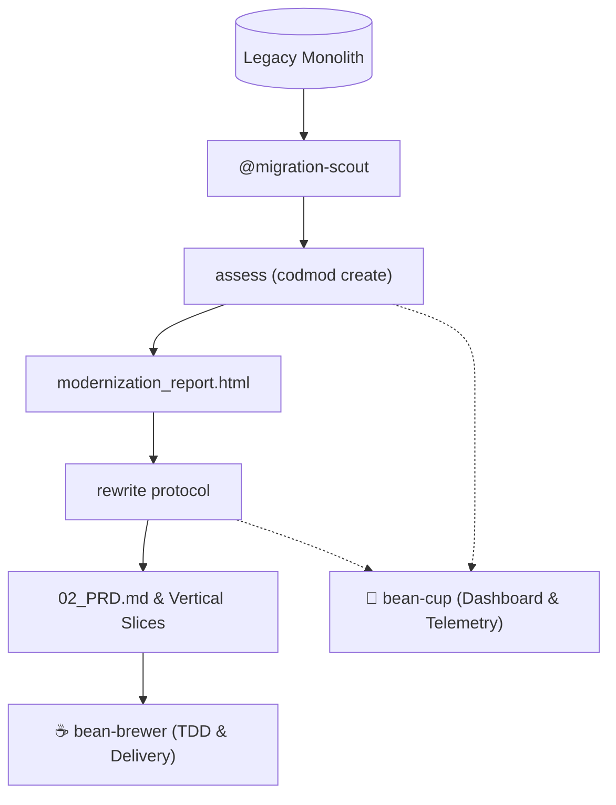

# ⚙️ Bean-Grinder

> Code Modernization, AST Transformations, and Migration Forge for Antigravity SDLC pipelines.

---

### ☕ Why "The Grinder"? (The Metaphor Explained)

In specialty coffee brewing, whole roasted beans cannot simply be dropped directly into boiling water—they must first pass through precision-calibrated burrs to be milled into uniform, structured particle sizes before optimal extraction can occur.

In software engineering, legacy monoliths and aging codebases are the coarse, uneven roasted beans: full of tightly coupled modules, deprecated APIs, outdated runtimes, and accumulated technical debt. 

**`bean-grinder`** is the mechanical burr mill of our autonomous barista swarm:
1. **Deconstruction:** It takes coarse legacy repositories (Java 8, WildFly, .NET Framework, monolithic SQL) and breaks them down into Abstract Syntax Trees (ASTs).
2. **Chaff Removal:** It strips away obsolete frameworks, dead vendor dependencies, and legacy boilerplate.
3. **Calibrated Modernization:** It runs Google Cloud **`codmod`** assessments and automated AST transformations to mill the legacy system into clean, uniform, decoupled vertical slices ready for implementation by **`bean-brewer`**.

---

## 🚀 Capabilities

- **`assess` (`skills/assess`)**: Complete Google Cloud `codmod` lifecycle management:
  - Agentic pre-scan via `@migration-scout`
  - Automated intent mapping (`JAVA_LEGACY_TO_MODERN`, `WILDFLY_LEGACY_TO_MODERN`, `MICROSOFT_MODERNIZATION`, `ARM_MIGRATION`, `CLOUD_TO_CLOUD`)
  - Interactive dry-run cost estimation
  - Execution of `codmod create`
  - Self-healing log collection via `codmod collect-logs`
  - Structured JSON telemetry logging
- **`rewrite` (`skills/rewrite`)**: Application rewrite protocol that ingests assessment reports (`modernization_report.html`), establishes parity baselines, and cuts vertical slices (`05_PLAN.md`).
- **`@migration-scout`**: Non-intrusive codebase scanner detecting language levels, application servers, and cloud SDKs.
- **`@ast-grinder`**: AST transformation engine executing automated codemods and syntax updates.
- **`@parity-auditor`**: Validates behavioral and API contract parity between legacy baselines and modernized targets.
- **`@msbuild`**: Manages verbose legacy .NET and C++ builds during modernization passes.

---

## 📦 Installation

```bash
# Local workspace
./install.sh

# Or global agy install
agy plugin install .
```

---

## 🛠️ Typical Workflow



1. Run `/assess` in `bean-grinder` to scan the legacy repository and execute `codmod`.
2. Inspect the generated `modernization_report.html`.
3. Run `/rewrite` to produce `02_PRD.md` with vertical slices and contract parity matrices.
4. Pass the slices to `bean-brewer` for implementation and delivery.

---

## 📜 License
Apache-2.0 - Copyright 2026 Google LLC.
