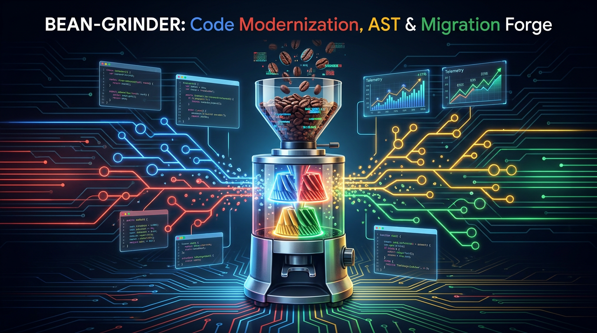
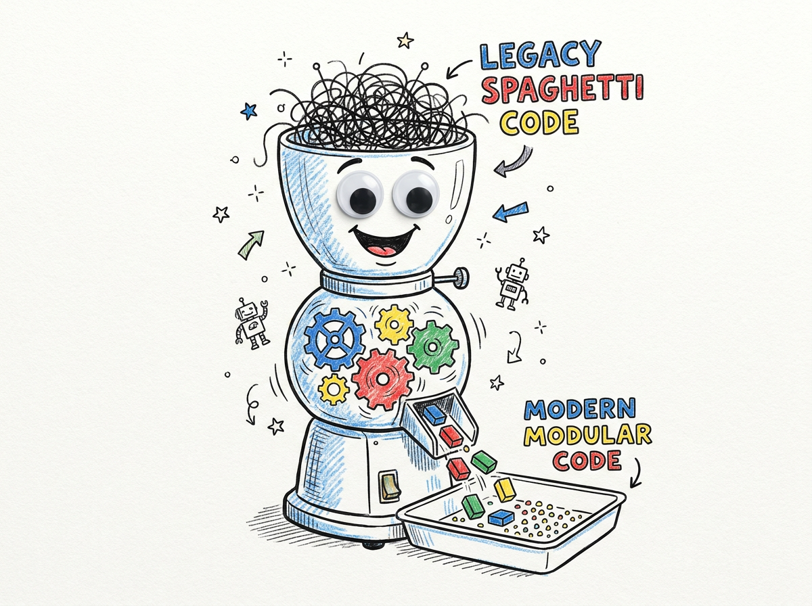
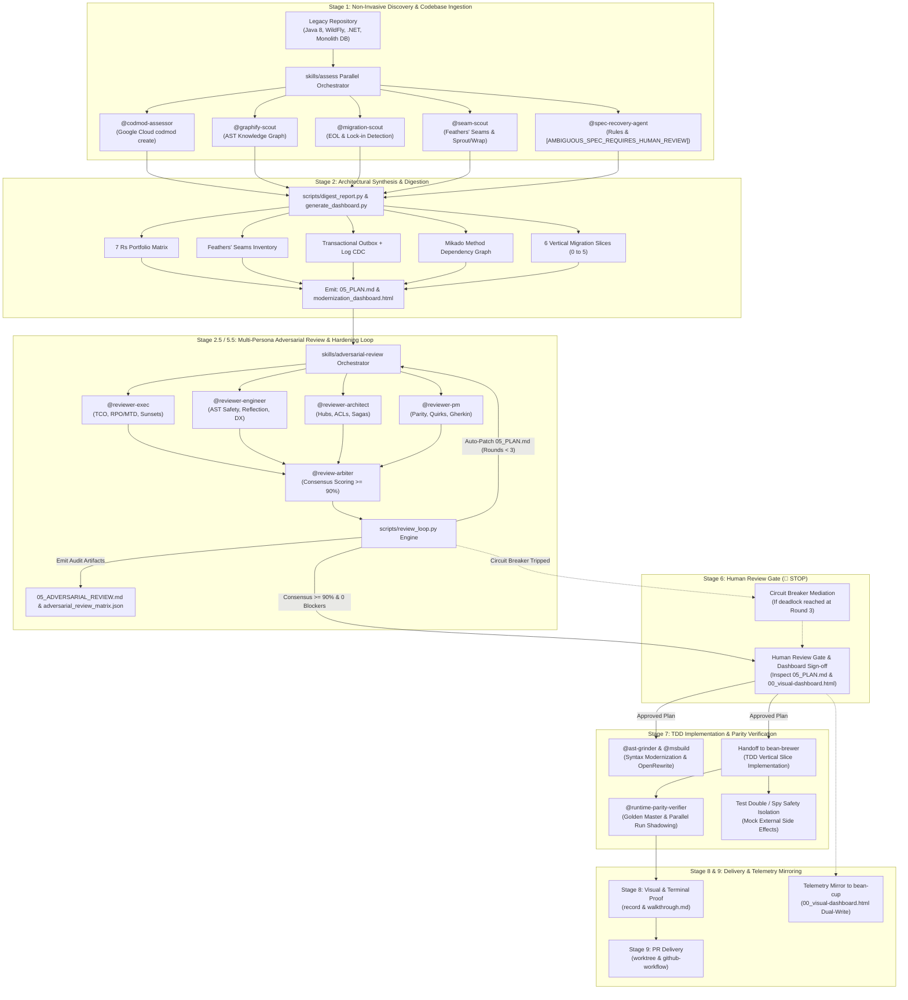

> [!WARNING]
> **Demo & Proof-of-Value Notice**: This repository contains demonstration and proof-of-value examples designed to illustrate AI-assisted engineering and autonomous agent workflows.
>
> - **Do Not Use Directly with Production Code**: This project is not intended for direct, out-of-the-box production deployment. Do not use these workflows, tools, or code samples directly in production environments without comprehensive testing and security audits.
> - **Review and Adopt**: We strongly recommend that you thoroughly review, validate, and adapt these concepts and patterns to build your own implementation tailored to your organization's specific requirements, architecture, and security policies.
> - **Disclaimer**: Provided strictly "as-is" for evaluation, educational, and reference purposes under the Apache-2.0 license, without warranties or SLA commitments of any kind.

<p align="center">
  
</p>

# ⚙️ Bean-Grinder

> **Autonomous Code Modernization, AST Transformation, and Legacy Migration Forge for Antigravity SDLC pipelines.**

---

## ☕ Why "The Grinder"? (The Metaphor Explained)

<p align="center">
  
</p>

In specialty coffee brewing, whole roasted beans cannot simply be dropped directly into boiling water—they must first pass through precision-calibrated burrs to be milled into uniform, structured particle sizes before optimal extraction can occur.

In software engineering, legacy monoliths and aging codebases are the coarse, uneven roasted beans: full of tightly coupled modules, deprecated APIs, outdated runtimes, and accumulated technical debt. 

**`bean-grinder`** is the mechanical burr mill of our autonomous barista swarm:
1. **Deconstruction:** It takes coarse legacy repositories (Java 8, WildFly, .NET Framework, monolithic SQL) and breaks them down into Abstract Syntax Trees (ASTs) and directed dependency graphs.
2. **Chaff Removal:** It strips away obsolete frameworks, dead vendor dependencies, and legacy boilerplate.
3. **Calibrated Modernization:** It runs Google Cloud **`codmod`** assessments, executes AST transformations, rationalizes architectures across the **7 Rs**, identifies Michael Feathers' seams, designs Transactional Outbox + Log-based CDC state pipelines, and mills the legacy system into clean, uniform, decoupled vertical slices ready for implementation by **`bean-brewer`**.

---

## 🏛️ Modernization Treatise: Core Philosophy & Architectural Principles

Legacy application modernization has evolved from an unpredictable, high-risk "big-bang" replacement into an empirical engineering discipline. Production monolithic systems frequently embody decades of mission-critical business rules, regulatory edge cases, and high-throughput transactional logic that are completely lost in naive greenfield rewrites.

`bean-grinder` enforces six non-negotiable architectural principles:

```
┌──────────────────────────────────────────────────────────────────────────────────────────────────┐
│                                 CORE MODERNIZATION TAXONOMY                                      │
├──────────────────────┬──────────────────────┬──────────────────────┬─────────────────────────────┤
│   7 Rs Portfolio     │    Michael Feathers  │   Strangler Fig &    │   State Integrity &         │
│   Rationalization    │    Seam Discovery    │   Branch Abstraction │   Transactional CDC         │
├──────────────────────┼──────────────────────┼──────────────────────┼─────────────────────────────┤
│ • Retain             │ • Object Seams       │ • Edge Ingress Proxy │ • No App Dual-Writes        │
│ • Retire             │ • Link Seams         │ • 5-Stage In-Process │ • No 2PC / Distributed XA   │
│ • Rehost             │ • Preprocessor Seams │   Branch Abstraction │ • Transactional Outbox      │
│ • Relocate           │ • Sprout Methods     │ • Page vs. Widget UI │ • Log-Based CDC (Debezium)  │
│ • Replatform         │ • Sprout Classes     │ • Mikado Dependency  │ • 4-Phase Data Cutover      │
│ • Refactor / Arch    │ • Wrap Methods       │   Graph (Leaf-first, │ • Distributed Sagas with    │
│ • Rebuild / Replace  │ • Wrap Classes       │   Hard git Reverts)  │   Compensating Actions      │
└──────────────────────┴──────────────────────┴──────────────────────┴─────────────────────────────┘
```

1. **Non-Invasive Ingestion (Zero Improvisation):** The analyzer must NEVER make speculative source-code edits during assessment. Legacy codebases are ingested factually as-is to preserve historical behavior.
2. **The 7 Rs Portfolio Rationalization:** Greenfield rebuild is a last resort. Every component module is classified into *Retain*, *Retire*, *Rehost*, *Relocate*, *Replatform*, *Refactor*, or *Rebuild* based on blast radius, inbound callers, and domain complexity.
3. **Michael Feathers' Seams & Decoupling Boundaries:** Decoupling occurs at proven seams (Object, Link, Preprocessor) using Sprout/Wrap patterns and in-process *Branch by Abstraction* before any physical microservice split.
4. **State Integrity via Outbox CDC (Rejection of Dual-Writes):** Application-level dual-writes and Two-Phase Commit (2PC) are strictly prohibited. Distributed state synchronization is achieved solely through the *Transactional Outbox Pattern* and log-based Change Data Capture (CDC via Debezium/Kafka).
5. **Mikado Method with Hard Reverts:** Refactoring experiments follow a strict DAG. When a compiler or characterization test fails, the system immediately executes `git reset --hard`, logs the prerequisite, and resolves leaf dependencies first.
6. **Golden Master & Parallel Run Verification:** Modernized components undergo traffic shadowing (GitHub Scientist pattern) with *Test Double / Spy Safety Isolation* at external side-effect boundaries (payment gateways, outbound emails, mutating external APIs).

---

## 🔄 The Multi-Stage Modernization Protocol (Why, What & How)

The modernization lifecycle is structured into five sequential, verifiable stages adhering to the **Bean-to-Cup** SDLC standard:



---

### Stage 1: Non-Invasive Discovery & Codebase Ingestion (`skills/assess`)

```
┌──────────────────────────────────────────────────────────────────────────────────────────────────┐
│ STAGE 1: NON-INVASIVE DISCOVERY & CODEBASE INGESTION                                             │
├──────────────────────────────────────────────────────────────────────────────────────────────────┤
│ WHY:  Legacy codebases cannot be safely modernized without complete, empirical knowledge of     │
│       their current state. Premature code edits or speculative refactoring cause silent failure. │
│ WHAT: Multi-agent concurrent extraction of AST structures, call graphs, EOL runtimes, seams, and │
│       implicit business rules without context window bloat or modifying source code.            │
│ HOW:  `skills/assess` validates GCP credentials and concurrently dispatches specialized agents:  │
│       • @codmod-assessor: Executes `codmod create`, capturing enterprise recipes & blockers.    │
│       • @graphify-scout: Executes `graphify . --directed` to extract graph topology.             │
│       • @migration-scout: Detects EOL runtimes (Java 8, .NET 4.8) and proprietary SDK lock-in.   │
│       • @seam-scout: Identifies Object, Link, and Preprocessor seams and Sprout/Wrap sites.      │
│       • @spec-recovery-agent: Reverse-engineers domain rules; flags ambiguities with HITL tokens.│
└──────────────────────────────────────────────────────────────────────────────────────────────────┘
```

#### Detailed Agent Protocols in Stage 1:
- **`@codmod-assessor`**: Runs Google Cloud `codmod create` against the target workspace. It auto-maps modernization intents, handles compilation diagnostics, and runs `codmod collect-logs` in case of failure to isolate issues into `modernization_report.html`.
- **`@graphify-scout`**: Evaluates directed AST graph models (`graphify . --directed`), generating `graphify-out/graph.json`, interactive `graphify-out/graph.html`, and `graphify-out/GRAPH_REPORT.md`.
- **`@migration-scout`**: Flags deprecated platform frameworks (e.g., Spring Framework 3/4, .NET Framework 2.0–4.8, Python 2.7, WildFly/WebLogic) and proprietary library lock-in.
- **`@seam-scout`**: Analyzes coupling points using Michael Feathers' taxonomy:
  - *Object Seams*: Points where method calls can be intercepted or overridden without changing source text (DI containers, polymorphic subclasses).
  - *Link Seams*: Points where intermediate bytecode or assemblies can be substituted at link/runtime (modular classpath replacement).
  - *Preprocessor Seams*: Points where conditional compilation or build-profile flags route execution.
  - *Sprout & Wrap*: Sites where new capabilities can be grafted via Sprout Methods/Classes or wrapped in Decorator/Facade layers without mutating legacy methods.
- **`@spec-recovery-agent`**: Reconstructs state machines, business invariant rules, and exception policies. Whenever legacy code exhibits undocumented behavior, it emits the mandatory human-in-the-loop token:
  ```
  [AMBIGUOUS_SPEC_REQUIRES_HUMAN_REVIEW]
  - Location: <file_path>:<line_range>
  - Context: <method or class signature>
  - Observed Behavior: <what the legacy code actually executes>
  - Ambiguity: <why intent is unclear: bug vs. undocumented edge-case rule>
  - Recommendation Options: Option A vs. Option B
  ```

---

### Stage 2: Architectural Synthesis & Digestion (`scripts/digest_report.py`)

```
┌──────────────────────────────────────────────────────────────────────────────────────────────────┐
│ STAGE 2: ARCHITECTURAL SYNTHESIS & DIGESTION                                                     │
├──────────────────────────────────────────────────────────────────────────────────────────────────┤
│ WHY:  Raw 4MB CodMod HTML reports and dense AST graphs overwhelm human and agent reasoning.     │
│       They must be distilled into a machine-parseable, risk-ordered architectural plan.          │
│ WHAT: Synthesizes a structured modernization matrix: 7 Rs categorization, Feathers' seams,      │
│       Transactional Outbox CDC state architecture, Mikado DAG, and 6 vertical execution slices. │
│ HOW:  Executed via `python3 scripts/digest_report.py`:                                           │
│       Combines CodMod findings with Graphify AST clusters to emit `migration_matrix.json`,       │
│       the comprehensive `05_PLAN.md`, and the interactive `modernization_dashboard.html`.        │
└──────────────────────────────────────────────────────────────────────────────────────────────────┘
```

#### Core Synthesized Artifacts:
1. **7 Rs Portfolio Rationalization Matrix:**
   Evaluates all identified domain clusters:
   - *Retain*: Modules with zero incoming churn and stable platform requirements.
   - *Retire*: Redundant or obsolete legacy modules identified for graceful decommissioning.
   - *Rehost / Relocate*: Containerizing standard modules for Cloud Run / GKE with minimal code churn.
   - *Replatform*: Upgrading runtimes (e.g., Java 8 ➔ Java 21 LTS, Spring Boot 2 ➔ 3.x) while retaining domain logic.
   - *Refactor / Rearchitect*: Decoupling high-blast-radius Central Dependency Hubs via Anti-Corruption Layers (ACL).
   - *Rebuild / Replace*: Greenfield re-implementation reserved strictly for commoditized domain features.

2. **Data Modernization & State Integrity (Transactional Outbox + Log-Based CDC):**
   - **Strictly Forbidden:** Application-level dual writes (which suffer from network partitions, split-brain scenarios, and lack atomic guarantees) and Distributed Two-Phase Commit (2PC / XA locks, which decimate availability and latency).
   - **Adopted Pattern:** Transactional Outbox Pattern + Log-Based CDC (Debezium tailing Postgres WAL / MySQL binlog into Kafka topics).
   - **4-Phase Data Cutover Protocol:**
     - *Phase A (Initial Snapshot & WAL Tailing):* Historical data backfilled; CDC streaming active; monolith authoritative.
     - *Phase B (Dual-Read Verification & Shadow Parity):* Monolith remains write-authoritative; target service reads and compares state shadow records.
     - *Phase C (Target Authoritative & Reverse CDC Rollback Guard):* Write traffic switched to target service; reverse-CDC replicates mutations back to the monolith for instant zero-loss rollback capability.
     - *Phase D (Sever Sync & Decommission):* Reverse CDC pipeline terminated; legacy monolithic tables retired.

3. **Mikado Method Dependency Graph:**
   Refactoring experiments follow a leaf-first directed acyclic graph (DAG). The golden safety rule is strictly observed:
   > *On compile or characterization test failure, immediately execute `git reset --hard`, record the discovered prerequisite node in the Mikado graph, and solve leaf prerequisites first.*

4. **Dependency-Ordered Vertical Slices:**
   - **Slice 0:** Build & Runtime Foundation (Java 21 LTS, Spring Boot 3, Maven/Gradle, CI scaffolding).
   - **Slice 1:** Standalone Leaf Modules & Value Objects (Zero inbound dependencies, pure business logic).
   - **Slice 2:** Core Domain Repositories & Data Access Layer (Entities, Spring Data JPA / Hibernate 6).
   - **Slice 3:** Central Dependency Hubs & Monolith Decoupling (High-blast-radius coupling classes isolated with Branch by Abstraction).
   - **Slice 4:** Ingress Controllers, REST APIs & Edge Adapters (Spring MVC controllers, OpenAPI contracts).
   - **Slice 5:** End-to-End Runtime Parity Verification & Golden Master Testing.

---

### Stage 2.5: Multi-Persona Adversarial Review & Hardening (`skills/adversarial-review`)

```
┌──────────────────────────────────────────────────────────────────────────────────────────────────┐
│ STAGE 2.5: MULTI-PERSONA ADVERSARIAL REVIEW & HARDENING                                          │
├──────────────────────────────────────────────────────────────────────────────────────────────────┤
│ WHY:  Single-agent modernization proposals suffer from blind spots: architects over-engineer,   │
│       engineers break dynamic reflection, PMs overlook legacy quirks, and execs miss TCO risks.  │
│ WHAT: 4-way cross-functional adversarial critique scored by an impartial arbiter to iteratively  │
│       harden `05_PLAN.md` until reaching >= 90.0% consensus and zero Critical/High blockers.     │
│ HOW:  `skills/adversarial-review` coordinates the reviewer swarm and `scripts/review_loop.py`:   │
│       Iterates up to 3 rounds, patches the plan, and emits `05_ADVERSARIAL_REVIEW.md`.          │
└──────────────────────────────────────────────────────────────────────────────────────────────────┘
```

#### Review Persona Roster:
- **`@reviewer-exec` (Business & Operations):** Audits Total Cost of Ownership (TCO), cloud run-rate, licensing sunsets (Oracle JDK, proprietary app servers), milestone delivery risks, and rollback Recovery Time/Point Objectives (RTO/RPO).
- **`@reviewer-engineer` (Code & Developer Experience):** Audits AST transform safety, reflection/bytecode manipulation risks, local containerized build times, test fixture realism, and developer velocity.
- **`@reviewer-architect` (Distributed Systems & Scalability):** Audits Central Dependency Hub blast radius, Anti-Corruption Layer (ACL) boundary fidelity, stateful session leakage, and saga compensation semantics.
- **`@reviewer-pm` (Product & User Experience):** Audits functional parity, preservation of undocumented legacy edge cases, non-goals boundaries, and Gherkin scenario completeness.
- **`@review-arbiter` (Synthesis & Scoring):** Reconciles contradictory stakeholder trade-offs, computes the weighted consensus score, and produces actionable patch instructions for `scripts/review_loop.py`.

---

### Stage 3: Parity Verification & Sandboxed Execution

```
┌──────────────────────────────────────────────────────────────────────────────────────────────────┐
│ STAGE 3: PARITY VERIFICATION & SANDBOXED EXECUTION                                               │
├──────────────────────────────────────────────────────────────────────────────────────────────────┤
│ WHY:  A modernized service is only successful if it reproduces legacy behavior with 100%         │
│       fidelity while preventing duplicate real-world side effects during validation.             │
│ WHAT: Golden Master baseline characterization, Parallel Run traffic shadowing (GitHub Scientist),│
│       and Test Double / Spy safety isolation at all external boundaries.                         │
│ HOW:  Executed by `@runtime-parity-verifier` and `@ast-grinder`:                                 │
│       Compares responses in an isolated sandbox and logs diffs to `docs/parity_discrepancies.md`.│
└──────────────────────────────────────────────────────────────────────────────────────────────────┘
```

#### Parity Verification Architecture:
- **Golden Master Characterization:** Before modifying any legacy class, `@runtime-parity-verifier` captures black-box input/output fixtures across normal, boundary, and error conditions.
- **Parallel Run & Traffic Shadowing (GitHub Scientist):**
  Shadows incoming HTTP/RPC traffic to both legacy and modernized implementations simultaneously. Responses are diffed with configurable timestamp/UUID tolerance masks.
- **Test Double / Spy Safety Isolation:**
  When shadowing production traffic, external side effects (e.g., third-party payment gateways, downstream email dispatchers, external database writes) are wrapped in test doubles or spies to guarantee that shadowed requests never trigger duplicate real-world actions.
- **Automated AST Grinding (`@ast-grinder`):**
  Applies automated OpenRewrite recipes and AST codemods for syntax modernization (e.g., `javax.*` to `jakarta.*`, Java records, modern HTTP clients).

---

### Stage 4: Downstream Delivery & Telemetry Sync

```
┌──────────────────────────────────────────────────────────────────────────────────────────────────┐
│ STAGE 4: DOWNSTREAM DELIVERY & TELEMETRY SYNC                                                    │
├──────────────────────────────────────────────────────────────────────────────────────────────────┤
│ WHY:  Transitioning from analysis/planning to physical code execution requires explicit human    │
│       governance and persistent tracking across the developer workstation and IDE.               │
│ WHAT: Human review gate approval, handoff to implementation agents, and dual-write dashboard     │
│       mirroring into the Antigravity UI artifacts panel.                                         │
│ HOW:  Presents `05_PLAN.md` and `modernization_dashboard.html` to the user; on approval,         │
│       invokes `bean-brewer` for vertical slice execution and syncs telemetry to `bean-cup`.      │
└──────────────────────────────────────────────────────────────────────────────────────────────────┘
```

- **Human Review Gate (🛑 STOP):** The approved `05_PLAN.md`, physical contracts in `contracts/`, red-team audit summary, and unified `modernization_dashboard.html` are presented for explicit human review.
- **Handoff to `bean-brewer`:** Once approved, `bean-brewer` dispatches `@architect` and `@engineer` subagents to implement vertical slices using strict Test-Driven Development (TDD).
- **Dual-Write Telemetry Sync:** `modernization_dashboard.html` and `05_PLAN.md` are continuously mirrored to the active session brain artifacts directory (`00_visual-dashboard.html` and `05_plan.md`), providing real-time visibility in the IDE panel.

---

## 🛠️ Complete Agents, Skills & Tools Reference

### Autonomous Subagents (`agents/*.md`)

| Subagent | Role & Specialization | Key Operational Directives |
| :--- | :--- | :--- |
| **`@spec-recovery-agent`** | Domain Rule & Spec Extraction | Reverse-engineers business logic and state invariants; emits mandatory `[AMBIGUOUS_SPEC_REQUIRES_HUMAN_REVIEW]` token for undocumented behavior. |
| **`@seam-scout`** | Seam Discovery & Decoupling | Maps Michael Feathers' Object, Link, and Preprocessor seams; identifies Sprout/Wrap opportunities and Branch by Abstraction boundaries. |
| **`@codmod-assessor`** | Google Cloud CodMod Execution | Runs `codmod create`, intent selection, diagnostic failure collection via `codmod collect-logs`, and blocker synthesis in an isolated subagent. |
| **`@graphify-scout`** | AST Knowledge Graph Extraction | Runs `graphify . --directed`, validating topology artifacts, central dependency hubs, and modular community clusters. |
| **`@migration-scout`** | Runtime & Portfolio Scanner | Identifies EOL runtime versions (Java, .NET, Python), proprietary library lock-in, and rationalizes components across the 7 Rs. |
| **`@runtime-parity-verifier`** | Parity & Shadowing Verifier | Synthesizes Golden Master characterization tests; runs Parallel Run (GitHub Scientist) traffic shadowing with Test Double safety shields. |
| **`@ast-grinder`** | AST Transformation Engine | Executes automated OpenRewrite recipes, syntactic codemods, and deprecated API modernizations. |
| **`@msbuild`** | Legacy Build Sandbox Manager | Compiles and isolates verbose legacy .NET Framework and C++ builds without flooding LLM context windows. |
| **`@reviewer-exec`** | Adversarial Executive Reviewer | Audits TCO, cloud run-rate, licensing sunsets, milestone schedule risk, and rollback RPO/MTD. |
| **`@reviewer-engineer`** | Adversarial Engineering Reviewer | Audits AST safety, dynamic reflection breakage, local build performance, contract test fixtures, and DX. |
| **`@reviewer-architect`** | Adversarial Architecture Reviewer | Audits Central Dependency Hub blast radius, Anti-Corruption Layers, distributed statefulness, and horizontal scalability. |
| **`@reviewer-pm`** | Adversarial Product Reviewer | Audits functional parity, undocumented legacy quirks, Gherkin acceptance criteria, and non-goals. |
| **`@review-arbiter`** | Trade-Off Arbiter & Synthesizer | Reconciles conflicting stakeholder trade-offs, calculates weighted consensus ($\ge 90\%$), and compiles plan patch directives. |

### Specialized Skills (`skills/*/SKILL.md`)

| Skill | Namespace | Purpose |
| :--- | :--- | :--- |
| **`assess`** | `skills/assess/` | Parallel orchestrator validating GCP credentials, pre-flight cost estimation shield, and concurrently dispatching discovery subagents. |
| **`rewrite`** | `skills/rewrite/` | Application rewrite protocol: ingests assessment reports, digests semantic findings, maps runtimes, and cuts vertical slices into `05_PLAN.md`. |
| **`adversarial-review`**| `skills/adversarial-review/` | Multi-persona adversarial review & hardening loop: orchestrates reviewer swarm to iterate on `05_PLAN.md` until consensus. |

### Core CLI Utilities (`scripts/`)

| Script | Purpose | Key Flags & Options |
| :--- | :--- | :--- |
| **`scripts/digest_report.py`** | Dual-lens digest CLI synthesizing `codmod` reports with `graphify` AST graphs. | `--codmod <html_path>`<br/>`--graphify <dir_path>`<br/>`--plan-out <path>`<br/>`--matrix-out <path>`<br/>`--dashboard-out <path>` |
| **`scripts/generate_dashboard.py`** | Responsive HTML modernization dashboard generator. | Supports 11 dedicated tabs (including 🛡️ Adversarial Review), dark/light themes, inline search, embedded iframe & digest toggles, and UI artifact mirroring (`--review-matrix` supported). |
| **`scripts/review_loop.py`** | Multi-persona adversarial review & hardening engine. | `--plan-dir <dir>`<br/>`--simulate-round <1\|2\|3>`<br/>`--ingest-review <path>`<br/>`--persona <exec\|engineer\|architect\|pm>`<br/>`--threshold 90.0`<br/>`--max-rounds 3` |

---

## 📊 The Unified Modernization Dashboard (`modernization_dashboard.html`)

The interactive dashboard provides a responsive, single-pane-of-glass interface featuring 11 dedicated tabs:

```
┌──────────────────────────────────────────────────────────────────────────────────────────────────┐
│                             MODERNIZATION DASHBOARD NAVIGATION TABS                              │
├───────────────┬───────────────┬───────────────┬───────────────┬──────────────────────────────────┤
│ 📊 Scorecard  │ ⚡ Slices      │ ⚠️ Hubs       │ 🧩 Modules    │ 🏛️ 7 Rs Strategy                 │
├───────────────┼───────────────┼───────────────┼───────────────┼──────────────────────────────────┤
│ ✂️ Seams      │ 🔄 Outbox CDC │ 📋 CodMod     │ 🕸️ Graphify   │ 🛡️ Adversarial Review             │
├───────────────┴───────────────┴───────────────┴───────────────┴──────────────────────────────────┤
│ 🗺️ Migration Plan (05_PLAN.md with Hardening Audit Log)                                          │
└──────────────────────────────────────────────────────────────────────────────────────────────────┘
```

1. **📊 Executive Scorecard:** High-level metrics (Total Nodes, Dependency Edges, Central Hubs, Component Modules, Transformation Recipes, and Phased Roadmap).
2. **⚡ Vertical Slices (Kanban):** Visual execution board organizing Slices 0 through 5 into serial dependencies vs. parallel candidate tasks.
3. **⚠️ Central Dependency Hubs:** Ranked list of high-blast-radius classes with in/out degree meters and suggested decoupling techniques (Interface Segregation, Facade, Branch by Abstraction).
4. **🧩 Component Modules:** Card grid of detected functional domain clusters with inline real-time search.
5. **🏛️ 7 Rs Strategy:** Portfolio matrix evaluating each subsystem across Retain, Retire, Rehost, Relocate, Replatform, Refactor, and Rebuild.
6. **✂️ Feathers' Seams:** Decoupling boundaries, seam types (Object/Link/Preprocessor), and Sprout/Wrap intervention points.
7. **🔄 Outbox & CDC Architecture:** State integrity specifications, prohibited anti-patterns (dual writes, 2PC), the formal 4-phase data cutover protocol, and the Mikado Method dependency DAG.
8. **📋 Google Cloud CodMod Report:** View switcher toggling between the embedded full 3.9MB interactive report and a synthesized task digest.
9. **🕸️ Graphify AST Visualizer:** View switcher toggling between the interactive Graphify AST network graph and the Markdown topology report.
10. **🛡️ Adversarial Review:** Interactive consensus scorecard, 4 stakeholder reviewer cards (`@reviewer-exec`, `@reviewer-engineer`, `@reviewer-architect`, `@reviewer-pm`), cross-functional trade-off resolutions (`@review-arbiter`), active flaw remediation directives, and multi-round convergence history.
11. **🗺️ Migration Plan:** Embedded, interactive rendering of `05_PLAN.md` with auto-patched hardening audit section.

---

## 💻 CLI Usage Guide

### 1. Run Complete Non-Invasive Assessment
```bash
# In your target legacy repository:
agy run assess --estimate-cost
```

### 2. Synthesize Reports into Migration Plan & Dashboard
```bash
python3 scripts/digest_report.py \
  --codmod /path/to/modernization_report.html \
  --graphify /path/to/graphify-out \
  --plan-out plans/modernization/05_PLAN.md \
  --matrix-out plans/modernization/migration_matrix.json \
  --dashboard-out plans/modernization/modernization_dashboard.html
```

### 3. Run Adversarial Review Loop & Plan Hardening
```bash
# Option A: Run via agy skill orchestrator:
agy run adversarial-review --plan plans/modernization/05_PLAN.md

# Option B: Run directly via CLI engine (ingest reviewer responses or simulate rounds):
python3 scripts/review_loop.py \
  --plan-dir plans/modernization/ \
  --simulate-round 1 \
  --threshold 90.0 \
  --max-rounds 3
```

### 4. Regenerate & Open Interactive Dashboard
```bash
# Regenerate dashboard with the review matrix:
python3 scripts/generate_dashboard.py \
  --matrix plans/modernization/migration_matrix.json \
  --report /path/to/modernization_report.html \
  --graph /path/to/graphify-out/graph.json \
  --plan plans/modernization/05_PLAN.md \
  --review-matrix plans/modernization/adversarial_review_matrix.json \
  --output-dir plans/modernization/

# Open locally in your browser:
open plans/modernization/modernization_dashboard.html
```

---

## 🧪 Testing & Validation

All subagents, skills, scripts, and schemas are continuously verified against the Antigravity 2.0 CLI specification:

```bash
# Run all unit tests:
python3 -m unittest discover tests

# Validate Antigravity 2.0 plugin schema:
agy plugin validate .
```

---

## 📦 Installation

```bash
# Install locally in workspace:
./install.sh

# Or install globally into Antigravity:
agy plugin install .
```

---

## 📜 License
Apache-2.0 - Copyright 2026 Google LLC.

