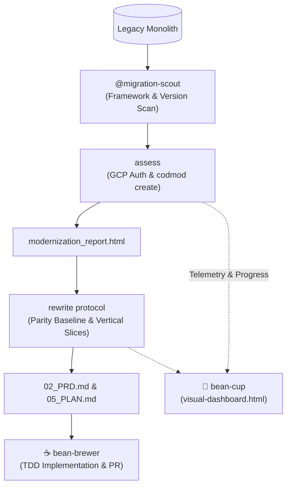

# ⚙️ Bean-Grinder

> Code Modernization, AST Transformations, and Migration Forge for Antigravity SDLC pipelines.

---

## ☕ Why "The Grinder"? (The Metaphor Explained)

In specialty coffee brewing, whole roasted beans cannot simply be dropped directly into boiling water—they must first pass through precision-calibrated burrs to be milled into uniform, structured particle sizes before optimal extraction can occur.

In software engineering, legacy monoliths and aging codebases are the coarse, uneven roasted beans: full of tightly coupled modules, deprecated APIs, outdated runtimes, and accumulated technical debt. 

**`bean-grinder`** is the mechanical burr mill of our autonomous barista swarm:
1. **Deconstruction:** It takes coarse legacy repositories (Java 8, WildFly, .NET Framework, monolithic SQL) and breaks them down into Abstract Syntax Trees (ASTs).
2. **Chaff Removal:** It strips away obsolete frameworks, dead vendor dependencies, and legacy boilerplate.
3. **Calibrated Modernization:** It runs Google Cloud **`codmod`** assessments and automated AST transformations to mill the legacy system into clean, uniform, decoupled vertical slices ready for implementation by **`bean-brewer`**.

---

## 🏛️ Origin & Architectural Rationale

### Spawned from `bean-to-cup`
**`bean-grinder`** was extracted from the monolithic [`bean-to-cup`](https://github.com/sapientcoffee/bean-to-cup) repository as part of a modular decomposition of the Antigravity barista swarm.

### Why Decompose?
1. **Dedicated Migration Specialization:** Enterprise codebase modernization, AST transformations, and Google Cloud `codmod` executions are specialized operations with unique prerequisites (GCP authorization, dry-run cost estimation, AST parsers). Isolating them prevents cluttering day-to-day feature development.
2. **Clean Separation from Day 2 SRE (`bean-descale`):** While `bean-descale` focuses on runtime health, incident triage, and operational resilience, `bean-grinder` focuses purely on static codebase transformation, language upgrades, and architectural rewrites.
3. **Parity-Preserving Handoffs:** `bean-grinder` generates assessment reports (`modernization_report.html`) and parity contracts (`02_PRD.md`) that hand off directly to `bean-brewer` for implementation and to `bean-cup` for visual tracking.
4. **Independent Evolution:** Support for new `codmod` intents, AST transformation rules, and migration language targets can be added without modifying core feature delivery plugins.

---

## 🚀 Capabilities & Skills Reference

| Feature | Type | Description |
| :--- | :---: | :--- |
| **`assess` (`skills/assess`)** | Skill | Full Google Cloud `codmod` driver: pre-scan with `@migration-scout`, intent mapping (`JAVA_LEGACY_TO_MODERN`, `WILDFLY_LEGACY_TO_MODERN`, `MICROSOFT_MODERNIZATION`, `ARM_MIGRATION`, `CLOUD_TO_CLOUD`), interactive dry-run cost shields, execution of `codmod create`, self-healing diagnostic collection (`codmod collect-logs`), and JSON telemetry. |
| **`rewrite` (`skills/rewrite`)** | Skill | Language-agnostic rewrite brew protocol: ingests assessment reports, maps source-to-target runtimes, establishes strict contract parity, and cuts vertical slices into `05_PLAN.md`. |
| **`@migration-scout`** | Agent | Autonomous codebase scanner detecting source language levels, application servers, and cloud SDK lock-in. |
| **`@ast-grinder`** | Agent | AST transformation engine executing automated codemods, syntax modernization, and deprecated API replacements. |
| **`@parity-auditor`** | Agent | Compares legacy inputs/outputs and API schemas against modern reimplementations to guarantee strict functional parity. |
| **`@msbuild`** | Agent | Manages verbose legacy .NET and C++ builds during modernization passes without overflowing LLM context. |

---

## 🔄 Modernization Workflow



1. **Scan & Assess:** Run `/assess` to inspect the legacy codebase, estimate costs, and execute Google Cloud `codmod`.
2. **Review Report:** Inspect the generated `modernization_report.html` and telemetry logs.
3. **Formulate Parity Specification:** Run `/rewrite` to establish functional parity requirements and decompose the monolith into vertical slices (`02_PRD.md`, `05_PLAN.md`).
4. **Execute & Verify:** Dispatch slices to `bean-brewer` for implementation and `@parity-auditor` for validation.

---

## 📦 Installation

```bash
# Local workspace
./install.sh

# Or global agy install
agy plugin install .
```

---

## 📜 License
Apache-2.0 - Copyright 2026 Google LLC.
