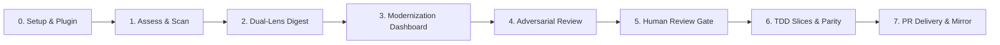
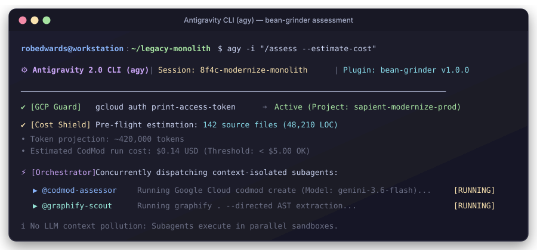
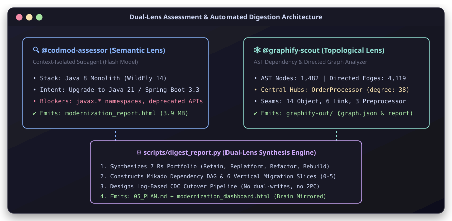
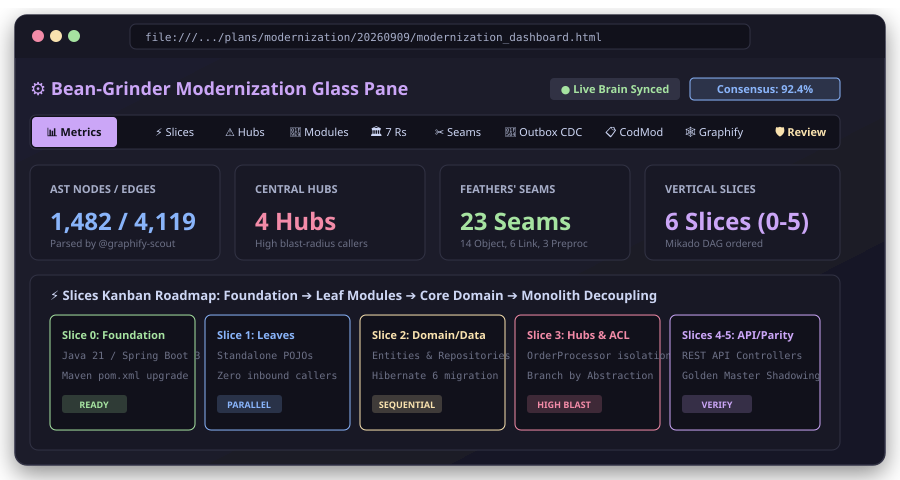
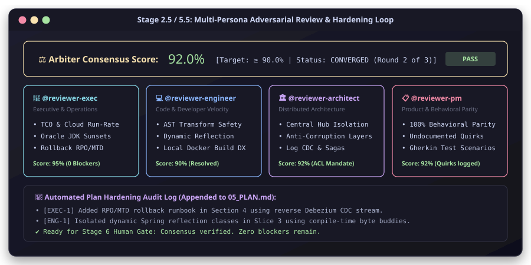
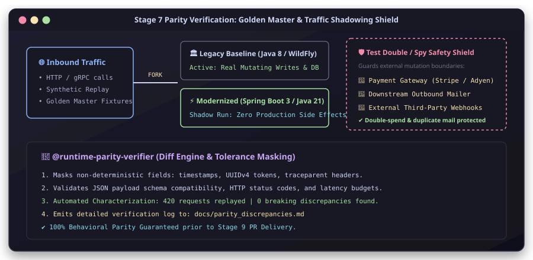
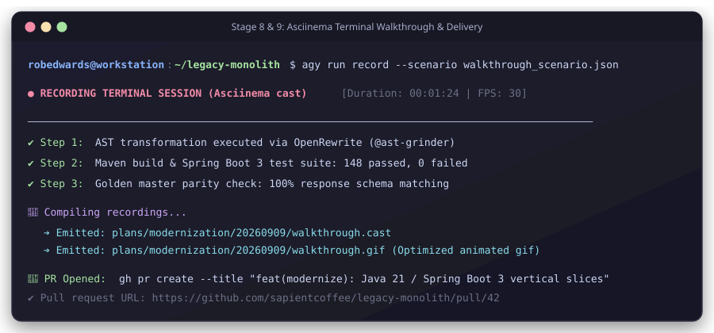

<!--
Copyright 2026 Google LLC

Licensed under the Apache License, Version 2.0 (the "License");
you may not use this file except in compliance with the License.
You may obtain a copy of the License at

    https://www.apache.org/licenses/LICENSE-2.0

Unless required by applicable law or agreed to in writing, software
distributed under the License is distributed on an "AS IS" BASIS,
WITHOUT WARRANTIES OR CONDITIONS OF ANY KIND, either express or implied.
See the License for the specific language governing permissions and
limitations under the License.
-->

# ⚙️ Bean-Grinder: AGY CLI End-to-End Workflow Guide

> **A comprehensive, step-by-step guide to executing autonomous application modernization, AST transformation, and parity-preserving rewrites with the Antigravity 2.0 CLI (`agy`).**

---

## 📖 Overview

The **`bean-grinder`** plugin equips the **Antigravity CLI (`agy`)** with an autonomous engineering swarm specialized in legacy modernization. Rather than risking naive "big-bang" rewrites, `bean-grinder` decomposes monolithic legacy codebases (Java 8, WildFly, .NET Framework, monolithic SQL) through dual-lens AST and semantic scanning, hardens migration plans via multi-persona adversarial review, and executes dependency-ordered vertical slices with strict runtime parity verification.

This guide walks through every step of using `bean-grinder` under the AGY CLI—from initial setup to final pull request delivery.

---

## 🗺️ High-Level Modernization Lifecycle



---

## 🛠️ Step 0: Prerequisites & Plugin Installation

Before running `bean-grinder` in the Antigravity CLI, ensure your workstation environment meets the following requirements:

### 1. Verify Antigravity CLI (`agy`)
Ensure `agy` is installed and available in your shell path:
```bash
which agy
agy --help
```

### 2. Verify Google Cloud Authentication & CodMod
`bean-grinder` integrates Google Cloud's `codmod` engine for deep modernization recipe generation. Verify active credentials:
```bash
gcloud auth application-default login
gcloud auth print-access-token
gcloud config get-value project
```

### 3. Install & Validate the `bean-grinder` Plugin
You can install `bean-grinder` globally or link it to your active workspace:

```bash
# Option A: Run the local installer script:
./install.sh

# Option B: Install directly via agy:
agy plugin install .

# Validate plugin schema and agent mappings:
agy plugin validate .
```

Expected validation output:
```text
  [ok]    .
          ✔ skills      : 4 processed (assess, synthesize, rewrite, adversarial-review)
          ✔ agents      : 14 processed
```

---

## 🚀 Step 1: Launch AGY CLI & Run Non-Invasive Assessment

Navigate to your target legacy repository and start an Antigravity CLI session. You can run interactively with the terminal user interface (TUI) or pass an initial command.

### Launching the CLI
```bash
cd /path/to/legacy-monolith

# Interactive mode with slash command:
agy -i "/assess"

# Or launch the interactive prompt directly:
agy
```

When inside the interactive session, invoke the assessment skill:
```text
> /assess
```

### What Happens Behind the Scenes:
1. **GCP Credential Guard**: Verifies active GCP authentication tokens before invoking remote services.
2. **Concurrent Subagent Dispatch**: AGY CLI launches two context-isolated subagents in parallel to prevent context pollution:
   - **`@codmod-assessor`**: Executes Google Cloud `codmod create`, mapping frameworks, analyzing deprecated APIs, and generating `modernization_report.html`.
   - **`@graphify-scout`**: Executes `graphify . --directed` to extract topological AST call graphs, central dependency hubs, and component clusters.

### Visual: AGY CLI Assessment Launch



> [!TIP]
> **Screenshot / GIF Placeholder**:
> If recording a live session, replace `../assets/screenshots/01_agy_launch_assess.svg` with an animated terminal recording `plans/modernization/walkthrough_assess.gif`.

---

## 🔍 Step 2: Architectural Synthesis & Slicing (`skills/synthesize`)

Once discovery scouts conclude their scans, the synthesis engine reconciles their findings into actionable engineering plans.

Synthesis can be invoked automatically by `/assess`, or **executed repeatedly on demand as a standalone step** whenever you want to re-slice domains, incorporate human domain clarifications, or update cloud targets without re-running expensive discovery scouts.

### Running Standalone Synthesis

```bash
# Option A: In the AGY CLI interactive session:
> /synthesize

# Option B: Run the skill helper script directly:
python3 skills/synthesize/scripts/synthesize_runner.py --run-dir latest

# Option C: Run digest_report.py with auto-discovery from an existing run:
python3 scripts/digest_report.py --from-run latest
```

You can also dispatch **`@synthesis-agent`** directly within the AGY session to customize vertical slicing boundaries around domain contexts or fold verified business invariants into the acceptance gates of `05_PLAN.md`.

### Emitted Modernization Artifacts:
| Artifact | Location | Purpose |
| :--- | :--- | :--- |
| **`05_PLAN.md`** | `assessments/runs/.../04_migration_plan/05_PLAN.md` | Mikado dependency-ordered implementation plan covering Slices 0 to 5. |
| **`migration_matrix.json`** | `assessments/runs/.../02_synthesis/migration_matrix.json` | Machine-readable dataset of 7 Rs strategies, Feathers' seams, and CDC cutover phases. |
| **`vertical_slices.json`** | `assessments/runs/.../02_synthesis/vertical_slices.json` | Standalone vertical slice definitions. |
| **`index.html`** | `assessments/runs/.../index.html` | Unified 11-tab interactive HTML glass pane. |
| **`00_visual-dashboard.html`** | `<appDataDir>/brain/<id>/00_visual-dashboard.html` | Live UI brain mirror for instant side-panel viewing. |

### Visual: Dual-Lens Subagents & Synthesis Architecture



---

## 📊 Step 3: Navigating the 11-Tab Unified Modernization Dashboard

Open the synthesized dashboard in your browser to inspect the full architectural breakdown:

```bash
open plans/modernization/20260909_1400/modernization_dashboard.html
```

### Visual: 11-Tab Modernization Glass Pane



### Deep-Dive into Key Dashboard Tabs:

1. **📊 Executive Scorecard**:
   Displays high-level quantum metrics: AST node and edge counts, central dependency hubs, detected modernization blockers, and estimated LOC transition volume.
2. **⚡ Vertical Slices (Kanban)**:
   Breaks the migration into 6 dependency-ordered vertical slices:
   - **Slice 0: Build & Runtime Foundation** (Java 21, Spring Boot 3, build tools).
   - **Slice 1: Standalone Leaf Modules** (POJOs, utility classes, zero inbound callers).
   - **Slice 2: Core Domain & Data Access** (Entities, Spring Data JPA / Hibernate 6).
   - **Slice 3: Central Dependency Hubs** (Monolith decoupling using Branch by Abstraction and Anti-Corruption Layers).
   - **Slice 4: Ingress Controllers & Edge APIs** (REST endpoints, contract validation).
   - **Slice 5: Runtime Parity Verification** (Golden Master characterization).
3. **⚠️ Central Dependency Hubs**:
   Identifies high-blast-radius classes (e.g., classes with 30+ incoming callers) that must be decoupled using Facades and in-process Branch by Abstraction rather than direct rewrites.
4. **🧩 Component Modules**:
   Interactive card grid displaying identified functional domains with real-time text search.
5. **🏛️ 7 Rs Strategy Matrix**:
   Classifies each subsystem into *Retain*, *Retire*, *Rehost*, *Relocate*, *Replatform*, *Refactor*, or *Rebuild*.
6. **✂️ Michael Feathers' Seams**:
   Inventories Object Seams, Link Seams, and Preprocessor Seams, pinpointing Sprout Method and Wrap Class insertion points.
7. **🔄 Outbox CDC & State Integrity**:
   Documents the strict rejection of dual writes and 2PC distributed transactions, detailing the 4-phase Debezium/Kafka CDC cutover protocol.
8. **📋 Google Cloud CodMod**:
   Embedded interactive viewer displaying original `codmod` recipes and diagnostics.
9. **🕸️ Graphify AST Visualizer**:
   Interactive network graph of code dependencies.
10. **🛡️ Adversarial Review Scorecard**:
    Live consensus scores, reviewer critiques, and trade-off resolutions.
11. **🗺️ Migration Plan**:
    Embedded rendering of `05_PLAN.md` with complete hardening audit logs.

---

## 🛡️ Step 4: Multi-Persona Adversarial Review & Plan Hardening

Before any code is altered, `bean-grinder` subjects `05_PLAN.md` to an adversarial critique to eliminate architectural blind spots.

### Running the Review Loop in AGY CLI
```text
> /adversarial-review --plan plans/modernization/20260909_1400/05_PLAN.md
```

Or run the standalone engine directly:
```bash
python3 scripts/review_loop.py \
  --plan-dir plans/modernization/20260909_1400 \
  --simulate-round 1 \
  --threshold 90.0 \
  --max-rounds 3
```

### The 4 Review Personas & Arbiter:
- **💼 `@reviewer-exec` (TCO & Operations)**: Audits total cost of ownership, cloud run-rate (Cloud SQL/GKE), licensing sunsets (Oracle JDK), and rollback RPO/MTD.
- **💻 `@reviewer-engineer` (AST Safety & DX)**: Audits AST transform safety, reflection traps, local Docker build times, and contract testability.
- **🏛️ `@reviewer-architect` (Distributed Architecture)**: Audits Central Hub blast radius, Anti-Corruption Layer (ACL) boundaries, and Outbox CDC data integrity.
- **📋 `@reviewer-pm` (Behavioral Parity)**: Audits functional parity, preservation of undocumented legacy quirks, and Gherkin scenario completeness.
- **⚖️ `@review-arbiter` (Trade-off Arbiter)**: Reconciles competing stakeholder trade-offs and calculates the consensus score:

$$\text{Consensus Score} = \max(0, 100 - (25C + 10H + 3M + 1L))$$

Where $C$ = Critical, $H$ = High, $M$ = Medium, and $L$ = Low blockers.

### Visual: Adversarial Review & Convergence Loop



> [!IMPORTANT]
> **Convergence Criteria**:
> The loop auto-patches `05_PLAN.md` for up to 3 rounds. The plan passes ONLY when **Consensus $\ge 90.0\%$** and **Zero Critical or High blockers** remain. If deadlocked after Round 3, a circuit breaker trips and flags the disagreement for human arbitration.

---

## 🛑 Step 5: Stage 6 Human Review Gate

Once the adversarial review converges, the AGY CLI halts execution at the **Human Review Gate**:

```text
🛑 STAGE 6 HUMAN REVIEW GATE
The modernization implementation plan has achieved 92.0% consensus across all 4 reviewer personas.
• Plan: plans/modernization/20260909_1400/05_PLAN.md
• Dashboard: plans/modernization/20260909_1400/modernization_dashboard.html
• Open Tokens: 0 blocking [AMBIGUOUS_SPEC_REQUIRES_HUMAN_REVIEW] tokens

Do you approve proceeding to Stage 7 TDD Implementation? (yes/no)
```

### Inspecting Ambiguous Spec Tokens
If `@spec-recovery-agent` detected undocumented legacy quirks, they are presented with explicit choices:
```text
[AMBIGUOUS_SPEC_REQUIRES_HUMAN_REVIEW]
- Location: src/main/java/com/legacy/OrderService.java:142-158
- Context: calculateDiscount()
- Observed Behavior: Negative order totals return null instead of throwing an IllegalArgumentException.
- Ambiguity: Is null an expected downstream sentinel, or an unhandled edge-case bug?
- Options:
    1. Retain null return for 100% bug-for-bug compatibility.
    2. Throw IllegalArgumentException and update downstream callers.
```
Provide your choice in the CLI chat to resolve the token.

---

## ⚡ Step 6: Vertical Slice Migration & Parity Verification

Upon human approval, implementation begins. Slices are executed strictly in Mikado dependency order, using Test-Driven Development (TDD) via `bean-brewer` and automated syntax rewrites via `@ast-grinder`.

### 1. AST Code Transformations (`@ast-grinder`)
OpenRewrite and AST transformations execute modernizations automatically:
- `javax.*` namespace migrations to `jakarta.*`
- Upgrading imperative data access to Spring Data repositories
- Transforming legacy boilerplate classes into clean Java 21 records

### 2. Parity Verification & Traffic Shadowing (`@runtime-parity-verifier`)
To ensure zero behavioral drift:
- **Golden Master Characterization**: Captures baseline inputs and outputs from the legacy service.
- **Parallel Run Shadowing (GitHub Scientist pattern)**: Forks real or synthetic traffic to both the legacy service and the modernized service.
- **Test Double / Spy Safety Shield**: External side effects (e.g., credit card payment gateways, SMS/email dispatchers, external database writes) are wrapped in test doubles to guarantee that shadow requests never trigger duplicate real-world actions.
- **Discrepancy Logging**: Discrepancies are logged with timestamp/UUID masks to `docs/parity_discrepancies.md`.

### Visual: Parity Verification & Safety Shields



---

## 📦 Step 7: Walkthrough Recording, PR Delivery & Telemetry Mirroring

The final phase packages the verified migration, captures terminal proof, and opens a GitHub pull request.

### 1. Record Terminal Walkthrough (`record` skill)
Capture an animated proof of testing and execution:
```bash
agy run record --scenario walkthrough_scenario.json
```
This generates `plans/modernization/.../walkthrough.cast` and an optimized animated `walkthrough.gif`.

### 2. Open Pull Request via `gh` CLI
Adhering to our Git Delivery standard:
```bash
# Verify Git branch:
git status

# Create PR using GitHub CLI:
gh pr create \
  --title "feat(modernize): Java 21 / Spring Boot 3 vertical slice modernization" \
  --body-file plans/modernization/20260909_1400/PR_BODY.md
```

### 3. Dual-Write Telemetry Mirroring
`modernization_dashboard.html` and `05_PLAN.md` are continuously mirrored to the active session brain artifacts directory (`~/.gemini/antigravity/brain/<id>/`), providing real-time progress visibility in the Antigravity IDE and `bean-cup`.

### Visual: Terminal Recording & PR Delivery



---

## 📸 Practical Guide: Capturing Live Screenshots & GIFs

To replace the SVG mockups with real screenshots from your own environment:

### Capturing Terminal Sessions (GIF / Cast)
1. Use the bundled `record` skill or standard `asciinema`:
   ```bash
   asciinema rec walkthrough.cast
   # Run your agy commands...
   exit
   ```
2. Convert `.cast` to `.gif` using `agg`:
   ```bash
   agg walkthrough.cast plans/modernization/walkthrough.gif
   ```
3. Update the image links in your feature walkthrough (`08_WALKTHROUGH.md`) using repository-relative paths without a leading slash (e.g., `plans/modernization/walkthrough.gif`).

### Capturing Browser Dashboard Screenshots
1. Open `modernization_dashboard.html` in Chrome or your preferred browser.
2. Press `Cmd+Shift+P` (macOS) or `Ctrl+Shift+P` (Linux/Windows) and run **"Capture full size screenshot"**.
3. Save the image to `assets/screenshots/03_modernization_dashboard.png`.

---

## 💡 Quick Reference Cheat Sheet

### Common AGY CLI Commands for Bean-Grinder

| Intent | Command / Action |
| :--- | :--- |
| **Interactive Assessment** | `agy -i "/assess"` |
| **Non-Interactive Assessment** | `agy -p "/assess"` |
| **Adversarial Review** | `agy -i "/adversarial-review --plan plans/.../05_PLAN.md"` |
| **Synthesize Digest** | `python3 scripts/digest_report.py --report <path> --graph <path> --output-dir <dir>` |
| **Run Review Loop CLI** | `python3 scripts/review_loop.py --plan-dir <dir> --simulate-round 1` |
| **Regenerate Dashboard** | `python3 scripts/generate_dashboard.py --matrix <json> --report <html> --graph <json> --output-dir <dir>` |
| **Record Walkthrough** | `agy run record --scenario scenario.json` |
| **Validate Plugin** | `agy plugin validate .` |

---

## ☕ Summary

`bean-grinder` turns modernization from an unpredictable gamble into a disciplined, automated, and mathematically verifiable engineering workflow. By combining **Google Cloud `codmod`**, **directed AST graph analysis**, **multi-persona adversarial plan hardening**, and **runtime traffic shadowing**, your team can modernize legacy monoliths with total confidence under the Antigravity CLI.
