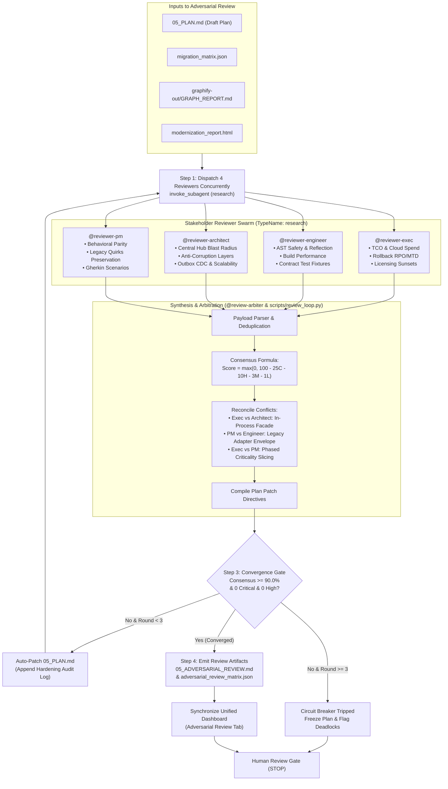

# Skill: Adversarial Review & Plan Hardening Loop

Orchestrate a multi-persona adversarial review on a modernization implementation plan (`05_PLAN.md`). Reconcile conflicting stakeholder incentives, resolve architectural trade-offs, and iteratively patch the plan until consensus criteria are met.



---

## Operational Protocol

### Prerequisites & Required Inputs
Before initiating the review loop, confirm the presence of:
1. `05_PLAN.md` (The drafted modernization plan to be audited).
2. `migration_matrix.json` (Discovered component inventory and 7 Rs mappings).
3. `graphify-out/GRAPH_REPORT.md` (Topological dependencies and Central Dependency Hubs).

---

### Step 1: Dispatch Adversarial Reviewer Swarm
Dispatch all four specialized stakeholder reviewers in parallel using a single `invoke_subagent` call.

#### Antigravity Subagent Execution Rules:
- Use `TypeName: "research"` with explicit `Role`s to run in read-only analysis sandboxes.
- Set `Model: "inherit"` on all reviewers to inherit the parent session's configured model tier.

#### Dispatch Payload:
Call `invoke_subagent` with the following configuration:

```json
{
  "Subagents": [
    {
      "TypeName": "research",
      "Role": "Executive Reviewer",
      "Prompt": "Audit 05_PLAN.md against migration_matrix.json and business risk parameters.\n1. Scrutinize Total Cost of Ownership (TCO), parallel cloud infrastructure run-rates, enterprise licensing sunsets, and project timeline feasibility.\n2. Verify rollback strategies, Recovery Point Objective (RPO), and Maximum Tolerable Downtime (MTD).\n3. Flag any unmetered cloud spend or untracked commercial licenses.\n4. Return structured JSON findings: [{id, severity, category, description, recommendation, blocker}].",
      "Model": "inherit"
    },
    {
      "TypeName": "research",
      "Role": "Engineering Reviewer",
      "Prompt": "Audit 05_PLAN.md for code transformation and developer experience feasibility.\n1. Verify safety of AST migrations, automated codemods, dynamic reflection risks, and build system upgrades.\n2. Audit local development loops, test execution performance, and contract test fixtures.\n3. Flag any untestable vertical slices or brittle code modifications.\n4. Return structured JSON findings: [{id, severity, category, description, recommendation, blocker}].",
      "Model": "inherit"
    },
    {
      "TypeName": "research",
      "Role": "Architecture Reviewer",
      "Prompt": "Audit 05_PLAN.md against graphify-out/GRAPH_REPORT.md and system dependencies.\n1. Audit Central Dependency Hubs to ensure high-blast-radius classes are protected by Anti-Corruption Layers (ACLs) or Facade isolation.\n2. Verify statefulness, distributed cache coherency, transactional outbox + CDC patterns, and zero-trust IAM boundaries.\n3. Flag any direct modifications to central hubs without modular isolation.\n4. Return structured JSON findings: [{id, severity, category, description, recommendation, blocker}].",
      "Model": "inherit"
    },
    {
      "TypeName": "research",
      "Role": "Product Reviewer",
      "Prompt": "Audit 05_PLAN.md for functional equivalence and scope control.\n1. Verify strict 1:1 functional and behavioral parity with legacy systems.\n2. Ensure undocumented legacy quirks, edge-case validation rules, and Gherkin acceptance criteria are preserved.\n3. Check scope discipline to prevent feature creep under the guise of modernization.\n4. Return structured JSON findings: [{id, severity, category, description, recommendation, blocker}].",
      "Model": "inherit"
    }
  ]
}
```

#### Execution Gate:
- **Do not poll or loop.**
- Stop calling tools and allow the Antigravity reactive messaging system to resume execution when all four subagents post completion notifications.

---

### Step 2: Ingest Findings & Synthesize Scorecard
Once all four subagent review payloads are received, execute the arbitration engine to deduplicate findings, calculate consensus scores, and synthesize directives:

1. Call `run_command`:
   ```bash
   python3 scripts/review_loop.py --plan-dir assessments/runs/latest/
   ```
2. The script computes the consensus score using:
   $$\text{Score} = \max(0, 100 - (25C + 10H + 3M + 1L))$$
   where $C = \text{Critical}$, $H = \text{High}$, $M = \text{Medium}$, and $L = \text{Low}$ severity findings.

---

### Step 3: Convergence Evaluation Gate
Evaluate the round scorecard:
- **Success Criteria**: Consensus Score $\ge 90.0\%$ with **0 Critical** and **0 High** flaws remaining.
  - **Verdict**: Mark plan as `CONVERGED_ROBUST`. Proceed to Step 4.
- **Revision Required** (Score $< 90.0\%$ or unresolved Critical/High issues, and $\text{Round} < 3$):
  - Append the arbiter's patch directives to `05_PLAN.md`.
  - Repeat from Step 1 for the next review round.
- **Circuit Breaker** (Score $< 90.0\%$ and $\text{Round} \ge 3$):
  - Mark verdict as `CIRCUIT_BREAKER_TRIGGERED`.
  - Halt automated iterations. Document the deadlocked trade-offs for human arbitration. Proceed to Step 4.

---

### Step 4: Synchronize Dashboards & Emit Artifacts
1. Call `run_command` to update the dashboard with the adversarial review results:
   ```bash
   python3 scripts/generate_dashboard.py --output-dir assessments/runs/latest/
   ```
2. **Verify Output Artifacts**:
   - `assessments/runs/latest/03_adversarial_review/05_ADVERSARIAL_REVIEW.md`
   - `assessments/runs/latest/03_adversarial_review/adversarial_review_matrix.json`
   - Updated `assessments/runs/latest/index.html` (with active Review Scorecard tab)
   - Mirrored `<appDataDir>/brain/<conversation-id>/00_visual-dashboard.html`

3. **Present Summary to User**:
   - Report the final consensus score, round count, and verdict (`CONVERGED_ROBUST` or `CIRCUIT_BREAKER_TRIGGERED`).
   - If converged: Present approved plan link and invite the user to approve execution.
   - If deadlocked: Detail the trade-off conflict between personas and request human decision.
