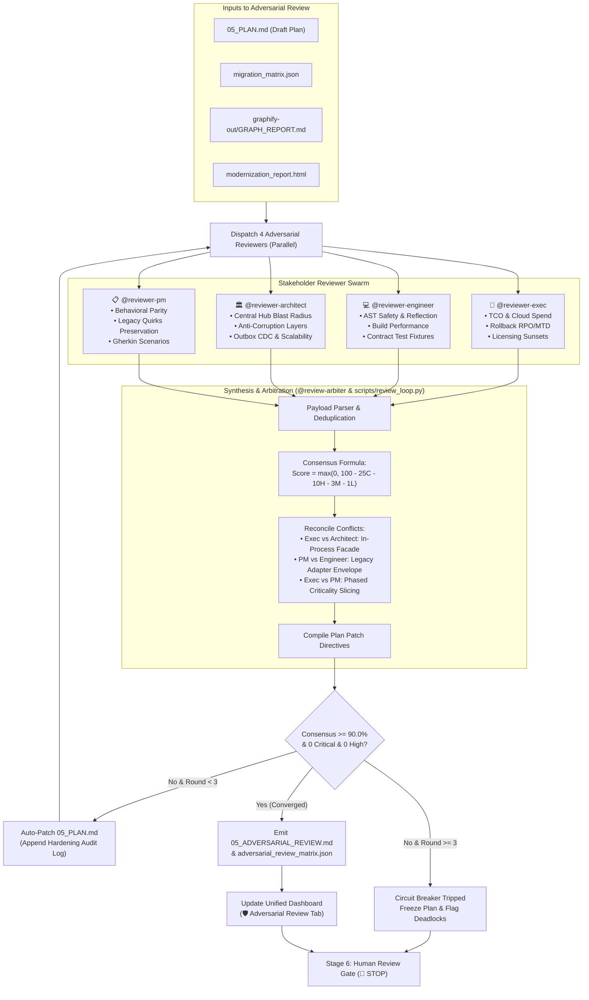

<!--
Copyright 2026 Google LLC

Licensed under the Apache License, Version 2.0 (the "License");
you may not use this file except in compliance with the License.
You may obtain a copy of the License at

    https://www.apache.org/licenses/LICENSE-2.0

Unless required by applicable law or agreed to in writing, software
distributed under the License is distributed on an "AS IS" BASIS,
WITHOUT WARRANTIES OR CONDITIONS OF ANY KIND, either express or implied.
See the License for the specific language governing permissions and
limitations under the License.
-->

# 🛡️ Skill: Adversarial Review & Plan Hardening Loop

This skill executes a multi-persona adversarial review loop on a newly drafted modernization implementation plan (`05_PLAN.md`). It pits four conflicting stakeholder incentives against each other to surface hidden risks, resolve architectural trade-offs, and iteratively patch the plan prior to presenting it at the Stage 6 Human Gate.

## 👥 Reviewer Swarm Personas
1. **💼 Executive (`@reviewer-exec`)**:
   - Focus: Total Cost of Ownership (TCO), cloud run-rate (Cloud SQL/GKE), licensing sunsets, schedule risk, rollback RPO/MTD.
   - Guardrail: Zero unmetered parallel cloud spend or untracked legacy enterprise licensing.
2. **💻 Engineering (`@reviewer-engineer`)**:
   - Focus: AST transformation safety, dynamic reflection breakage, local build times, contract test fixtures, developer experience (DX).
   - Guardrail: Zero dynamic reflection failures or untestable vertical slices.
3. **🏛️ Architecture (`@reviewer-architect`)**:
   - Focus: Central Dependency Hubs (`graphify`), Anti-Corruption Layers (ACLs), distributed statefulness, horizontal scalability, zero-trust IAM.
   - Guardrail: Zero direct modification of high-blast-radius Central Hubs without modular isolation.
4. **📋 Product & Parity (`@reviewer-pm`)**:
   - Focus: Functional/behavioral parity, undocumented legacy quirks, Gherkin acceptance criteria, scope control and non-goals.
   - Guardrail: Zero silent regression of undocumented edge cases or client-facing contract breakage.
5. **⚖️ Arbiter & Synthesizer (`@review-arbiter`)**:
   - Focus: Conflict resolution between contradictory stakeholder demands, consensus scoring, patch compilation, and convergence tracking.

---

## 🔄 Iterative Review Protocol



### Step 1: Dispatch Adversarial Swarm
Invoke subagents in parallel to review `05_PLAN.md`, `migration_matrix.json`, and `graphify-out/GRAPH_REPORT.md`:
```bash
# Each persona outputs findings in JSON or structured Markdown
```

### Step 2: Ingest & Synthesize Round
Run the review engine to calculate scores, reconcile trade-offs, and emit reports:
```bash
python3 scripts/review_loop.py --plan-dir plans/modernization/timestamp/
```

### Step 3: Check Convergence Criteria
- **Consensus Score:** $\ge 90.0\%$
- **Critical Blockers:** `0`
- **High Risks:** `0`
- If criteria are met $\rightarrow$ Plan is certified **`CONVERGED_ROBUST`**.
- If criteria are not met and $\text{Round} < 3 \rightarrow$ Arbiter directives are patched into `05_PLAN.md`, and Step 1 repeats for the next round.
- If criteria are not met and $\text{Round} \ge 3 \rightarrow$ **`CIRCUIT_BREAKER_TRIGGERED`**. The loop halts cleanly and documents the specific deadlock for human arbitration.

### Step 4: Synchronize Dashboards & Artifacts
Update the unified modernization dashboard to include the "🛡️ Adversarial Review" tab:
```bash
python3 scripts/generate_dashboard.py \
  --matrix plans/modernization/timestamp/migration_matrix.json \
  --report plans/modernization/timestamp/modernization_report.html \
  --graph graphify-out/graph.json \
  --plan plans/modernization/timestamp/05_PLAN.md \
  --review-matrix plans/modernization/timestamp/adversarial_review_matrix.json \
  --output-dir plans/modernization/timestamp/
```
Dual-write guarantees ensure `05_ADVERSARIAL_REVIEW.md` and `adversarial_review_matrix.json` mirror to the conversation artifacts directory.
