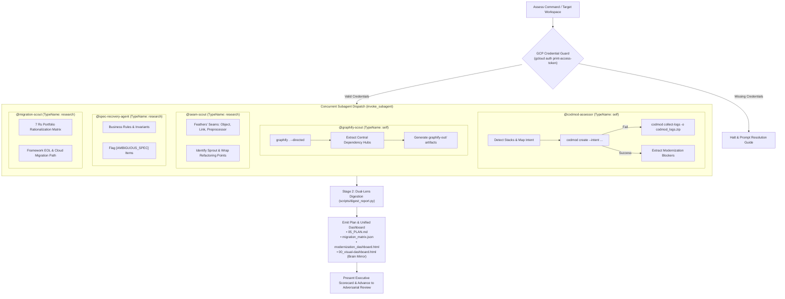

# ☕ Skill: CodMod App Modernization Assessment (Parallel Orchestrator)

You are executing the application modernization assessment workflow. Follow this step-by-step orchestrator protocol to run semantic and architectural assessments concurrently via context-isolated subagents.



---

## 1. Initial Setup & GCP Credential Guard

1. **Verify active GCP credentials and projects:**
   - Execute a shell command to ensure local authorization and target project parameters are set:
     ```bash
     gcloud config get-value project
     gcloud auth print-access-token
     ```
   - If credentials are missing or the command errors out, halt execution immediately and print a helpful, step-by-step resolution guide instructing the user to configure credentials (e.g., run `gcloud auth application-default login` or configure `GOOGLE_APPLICATION_CREDENTIALS`).

---

## 2. Dispatch Parallel Assessment Subagents

> [!IMPORTANT]
> **Antigravity CLI / 2.0 Subagent Architecture Rule:**
> In the Antigravity runtime, `invoke_subagent` accepts built-in subagent types:
> - **`"self"`**: Inherits the parent agent's configuration and tools (including `run_command` and file editing). **MUST be used for subagents executing CLI commands** (such as `@codmod-assessor` and `@graphify-scout`).
> - **`"research"`**: Context-isolated read-only exploration agent equipped with `view_file`, `grep_search`, `find_by_name`, and `list_dir`. **MUST be used for read-only scouts** (such as `@seam-scout`, `@spec-recovery-agent`, and `@migration-scout`).
> *(Note: Custom agent type names can only be passed if they were pre-registered during the conversation with `define_subagent`.)*

To maximize context hygiene and cut discovery execution time to a single concurrent turn, dispatch **all five** specialized subagents in a single `invoke_subagent` tool call:

```json
{
  "Subagents": [
    {
      "TypeName": "self",
      "Role": "CodMod Assessor",
      "Prompt": "You are the CodMod Assessor subagent (@codmod-assessor). Execute the Google Cloud codmod modernization assessment on codebase directory: {{target_dir}} (or current workspace).\n1. Inspect the codebase to detect frameworks and select optimal --intent and --optional-sections.\n2. Apply modelset routing (default --modelset=gemini-3.8-flash --region=global for Gemini 3.8 Flash (High), or --modelset=gemini-3.1-pro if pro is requested).\n3. Execute 'codmod create' non-interactively to generate modernization_report.html. Trap any failures with 'codmod collect-logs'.\n4. Extract key findings, LOC scale, top modernization blockers, and report path, returning a concise structured summary.",
      "Model": "flash"
    },
    {
      "TypeName": "self",
      "Role": "Graphify Scout",
      "Prompt": "You are the Graphify Scout subagent (@graphify-scout). Perform an architectural dependency and AST scan on codebase directory: {{target_dir}} (or current workspace).\n1. Run 'graphify . --directed' to construct the topological knowledge graph.\n2. Verify the generation of graphify-out/graph.json, graphify-out/graph.html, and graphify-out/GRAPH_REPORT.md.\n3. Parse the graph to extract total nodes, total edges, component module count, and top central dependency hubs (high blast radius).\n4. Return a concise structured summary with artifact paths.",
      "Model": "flash"
    },
    {
      "TypeName": "research",
      "Role": "Seam Scout",
      "Prompt": "You are the Seam Scout subagent (@seam-scout). Conduct a non-destructive AST and structural exploration on codebase directory: {{target_dir}} (or current workspace).\n1. Identify Michael Feathers' legacy seam opportunities: Object Seams (polymorphic overrides), Link Seams (classpath / build injection), and Preprocessor Seams.\n2. Identify candidates for Sprout Method, Sprout Class, Wrap Method, and Wrap Class.\n3. Identify high-blast-radius coupling bottlenecks and propose Branch by Abstraction boundaries.\n4. Return a structured Markdown table of discovered seams, target files, recommended decoupling patterns, and risk ratings.",
      "Model": "flash"
    },
    {
      "TypeName": "research",
      "Role": "Spec Recovery Scout",
      "Prompt": "You are the Specification Recovery Scout subagent (@spec-recovery-agent). Conduct code archaeology on codebase directory: {{target_dir}} (or current workspace).\n1. Extract hidden business rules, validation logic, entity lifecycle states, and implicit invariants embedded in legacy source code.\n2. Identify and flag any ambiguous, contradictory, or undocumented behaviors using the explicit marker [AMBIGUOUS_SPEC: <description>].\n3. Compile a structured inventory of domain concepts and business rules with file:line citations for Human-in-the-Loop review.",
      "Model": "flash"
    },
    {
      "TypeName": "research",
      "Role": "Migration Scout",
      "Prompt": "You are the Migration Scout subagent (@migration-scout). Perform an architectural and portfolio rationalization audit on codebase directory: {{target_dir}} (or current workspace).\n1. Scan all configuration files (pom.xml, build.gradle, *.csproj, package.json, etc.) and identify end-of-life (EOL) frameworks, runtime engines, and third-party libraries.\n2. Map every major subsystem into the Gartner/AWS 7 Rs modernization taxonomy: Retire, Retain, Rehost, Relocate, Repurchase, Replatform, Refactor/Re-architect.\n3. Outline the target Google Cloud compute (Cloud Run, GKE) and data tiers (Cloud SQL, Spanner, Firestore).\n4. Return a structured 7 Rs classification matrix and migration risk summary.",
      "Model": "flash"
    }
  ]
}
```

- **Zero Context Pollution:** All subagents run in isolated execution sandboxes, keeping raw CLI output, AST details, and intermediate HTML parsing out of the parent conversation context.
- **True Concurrent Execution:** All five subagents execute in parallel in the background without blocking each other.
- **Reactive Notification:** The orchestrator stops calling tools and lets the Antigravity reactive wakeup resume execution as subagents complete.

---

## 3. Ingest Subagent Findings & Automated Digestion

1. **Receive Concise Subagent Returns:**
   - Wait for all subagents to report completion.
   - Confirm key deliverables exist:
     * `modernization_report.html` (from `@codmod-assessor`)
     * `graphify-out/graph.json` (from `@graphify-scout`)
     * Seam audit findings (from `@seam-scout`)
     * Business rules and `[AMBIGUOUS_SPEC]` log (from `@spec-recovery-agent`)
     * 7 Rs rationalization matrix (from `@migration-scout`)

2. **Execute Automated Digestion & Unified Modernization Dashboard:**
   - Synthesize the dual-lens outputs into vertical slices, 7 Rs portfolio rationalization, Feathers' seams, Transactional Outbox + CDC data architectures, and the unified modernization dashboard:
     ```bash
     python3 scripts/digest_report.py \
       --report modernization_report.html \
       --graph graphify-out/graph.json \
       --output-dir assessments/runs/$(date +%Y%m%d_%H%M%S)
     ```
   - This automatically scaffolds the stage directories and produces:
     * `assessments/index.html` (Unified multi-run hub and latest run viewer)
     * `assessments/latest` (Symlink pointing directly to the active run)
     * `assessments/runs/<timestamp>/index.html` (Self-contained 11-tab interactive UI at the root of the run)
     * `assessments/runs/<timestamp>/run_manifest.json` (Machine-readable run metadata, scorecard, and status)
     * `assessments/runs/<timestamp>/01_discovery/` (Cleanly staged discovery artifacts with obvious names)
       - `codmod_assessment_report.html`
       - `graphify_ast_graph.json`
       - `graphify_visualizer.html`
       - `graphify_architecture_report.md`
       - `codmod_execution_telemetry.json`
     * `assessments/runs/<timestamp>/02_synthesis/` (Architectural matrices and vertical slices)
       - `migration_matrix.json`
       - `vertical_slices.json`
     * `assessments/runs/<timestamp>/04_migration_plan/` (Hardened execution plan and contracts)
       - `05_PLAN.md`
     * `00_visual-dashboard.html` (Automatically mirrored to the active conversation brain for instant UI inspection)

---

## 4. Report Mirroring & Telemetry

1. **Artifact Mirroring (Rule 5 compliance):**
   - The unified dashboard is automatically mirrored to `<appDataDir>/brain/<conversation-id>/00_visual-dashboard.html` by `digest_report.py`.
   - If manual mirroring of the raw assessment report is required, copy `codmod_assessment_report.html` into your active chat session's system artifacts directory as `08_visual-recap.html`.

2. **Write Telemetry Logs:**
   - Append structured telemetry to `assessments/runs/<timestamp>/01_discovery/codmod_execution_telemetry.json` and append to `assessments/telemetry.log`:
     ```json
     {
       "timestamp": "YYYY-MM-DDTHH:MM:SSZ",
       "command": "assess",
       "project": "<project-id>",
       "codebase_loc": <loc>,
       "detected_intent": "<intent>",
       "sections": ["<sections>"],
       "modelset": "<computed-modelset>",
       "status": "success",
       "duration_ms": <duration>
     }
     ```

3. **Present Scorecard:**
   - Present the Executive Scorecard, Central Dependency Hubs table, and planned vertical slices from `05_PLAN.md` to the user, highlighting the link to `assessments/index.html` (or `00_visual-dashboard.html`).
