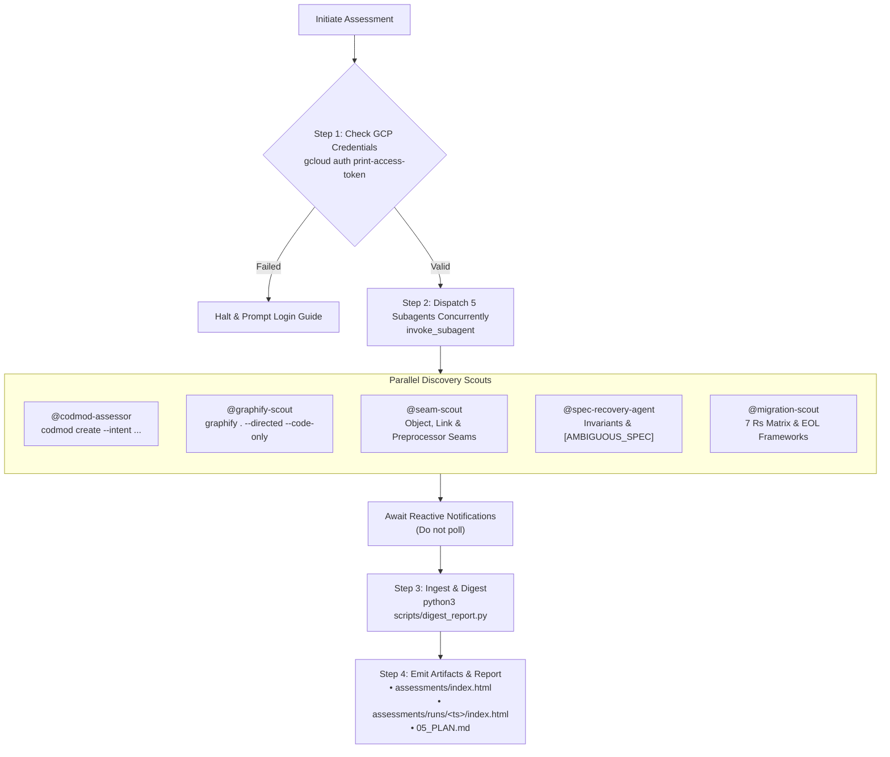

# Skill: Application Modernization Assessment

Orchestrate a comprehensive, non-destructive codebase discovery and modernization assessment across semantic, architectural, and procedural dimensions.



---

## Operational Protocol

### Step 1: Pre-Flight Credential Verification
Verify active Google Cloud authorization before launching remote assessment operations.

1. Call `run_command` to inspect active GCP configuration:
   ```bash
   gcloud config get-value project
   gcloud auth print-access-token
   ```
2. **Evaluation**:
   - If both commands return exit code `0` and a non-empty token: Proceed to Step 2.
   - If either command fails or exits non-zero:
     - Output an error instructing the user to authenticate via `gcloud auth application-default login` or set `GOOGLE_APPLICATION_CREDENTIALS`.
     - Halt execution immediately. Do not proceed to subagent dispatch.

---

### Step 2: Concurrent Subagent Dispatch
Dispatch all five specialized discovery scouts simultaneously in a single `invoke_subagent` tool call.

#### Antigravity Subagent Execution Rules:
- Use specific subagent `TypeName`s (`codmod-assessor`, `graphify-scout`, `seam-scout`, `spec-recovery-agent`, `migration-scout`) so `/agents` in the TUI displays meaningful names instead of generic 'self' or 'research'.
- Set `Model: "inherit"` on all subagents to preserve the parent session's configured model tier.

#### Dispatch Payload:
Call `invoke_subagent` with the following configuration:

```json
{
  "Subagents": [
    {
      "TypeName": "codmod-assessor",
      "Role": "CodMod Assessor",
      "Prompt": "Execute Google Cloud codmod modernization assessment on directory: {{target_dir}} (or workspace root).\n1. Inspect codebase to detect frameworks and select optimal --intent and --optional-sections.\n2. Apply modelset routing (default --modelset=gemini-3.8-flash --region=global, or --modelset=gemini-3.1-pro if requested).\n3. Execute 'codmod create' non-interactively to generate modernization_report.html (do NOT pass '--estimate-cost', as custom modelsets lack client pricing tables and will abort). Trap failures with 'codmod collect-logs'.\n4. Output to Sensible Location & AGY Artifact:\n   - Copy/stage report to '01_discovery/codmod_assessment_report.html'.\n   - Write to AGY brain artifacts directory '{{brain_dir}}/01_codmod-assessment.html' using write_to_file with ArtifactMetadata (Summary: 'Google Cloud CodMod modernization assessment report detailing intent recipes, modernization blockers, and flagged files.', UserFacing: true, RequestFeedback: false).\n5. Extract key modernization blockers, LOC count, flagged files, and output report path. Return a concise structured summary.",
      "Model": "inherit"
    },
    {
      "TypeName": "graphify-scout",
      "Role": "Graphify Scout",
      "Prompt": "Perform architectural dependency analysis on directory: {{target_dir}} (or workspace root).\n1. Execute 'graphify . --directed --code-only && graphify cluster-only .' to build the topological knowledge graph (using --code-only avoids requiring an LLM API key).\n2. Verify generation of graphify-out/graph.json, graphify-out/graph.html, and graphify-out/GRAPH_REPORT.md.\n3. Output to Sensible Location & AGY Artifact:\n   - Copy/stage report to '01_discovery/graphify_architecture_report.md'.\n   - Write to AGY brain artifacts directory '{{brain_dir}}/01_graphify-architecture.md' using write_to_file with ArtifactMetadata (Summary: 'Graphify AST architectural topology report detailing component modules, central dependency hubs, and coupling metrics.', UserFacing: true, RequestFeedback: false).\n4. Extract graph metrics: total nodes, edges, component clusters, and top central dependency hubs (high blast radius).\n5. Return a concise structured summary with artifact paths.",
      "Model": "inherit"
    },
    {
      "TypeName": "seam-scout",
      "Role": "Seam Scout",
      "Prompt": "Conduct non-destructive structural seam exploration on directory: {{target_dir}} (or workspace root).\n1. Identify Michael Feathers' seams: Object Seams (polymorphism/DI), Link Seams (classpath/assembly injection), and Preprocessor Seams.\n2. Identify candidate sites for Sprout Method, Sprout Class, Wrap Method, and Wrap Class.\n3. Propose Branch by Abstraction boundaries for monolithic subsystems.\n4. Output to Sensible Location & AGY Artifact:\n   - Write full seam analysis and table to '01_discovery/seam_findings.md' using write_to_file.\n   - Write to AGY brain artifacts directory '{{brain_dir}}/01_seam-findings.md' using write_to_file with ArtifactMetadata (Summary: 'Michael Feathers Seam Discovery inventory mapping Object, Link, and Preprocessor seams, and Sprout/Wrap intervention points.', UserFacing: true, RequestFeedback: false).\n5. Return a structured Markdown table: Component ID, Target Class, Seam Type, Decoupling Pattern, and Blast Radius.",
      "Model": "inherit"
    },
    {
      "TypeName": "spec-recovery-agent",
      "Role": "Spec Recovery Scout",
      "Prompt": "Perform specification archaeology on directory: {{target_dir}} (or workspace root).\n1. Reconstruct business rules, validation logic, entity lifecycle state machines, and implicit invariants from source code.\n2. Flag ambiguous, undocumented, or contradictory logic using '[AMBIGUOUS_SPEC: <description>]'.\n3. Output to Sensible Location & AGY Artifact:\n   - Write full specification matrix to '01_discovery/spec_invariants.md' using write_to_file.\n   - Write to AGY brain artifacts directory '{{brain_dir}}/01_spec-invariants.md' using write_to_file with ArtifactMetadata (Summary: 'Specification archaeology report recovering domain rules, state machines, and flagging ambiguous specifications requiring human review.', UserFacing: true, RequestFeedback: false).\n4. Return a structured Markdown table: Requirement ID, Summary, Source Location (file:line), Preconditions, Postconditions, and Review Status.",
      "Model": "inherit"
    },
    {
      "TypeName": "migration-scout",
      "Role": "Migration Scout",
      "Prompt": "Perform portfolio rationalization scan on directory: {{target_dir}} (or workspace root).\n1. Inspect build descriptors (pom.xml, build.gradle, *.csproj, package.json) for runtime versions, EOL frameworks, and third-party libraries.\n2. Classify major subsystems across the 7 Rs taxonomy: Retire, Retain, Rehost, Relocate, Repurchase, Replatform, Refactor/Re-architect.\n3. Map candidate Google Cloud target services (Cloud Run, GKE, Cloud SQL, Spanner).\n4. Output to Sensible Location & AGY Artifact:\n   - Write complete 7 Rs strategy to '01_discovery/migration_strategy.md' using write_to_file.\n   - Write to AGY brain artifacts directory '{{brain_dir}}/01_migration-strategy.md' using write_to_file with ArtifactMetadata (Summary: 'Migration strategy and 7 Rs portfolio rationalization matrix mapping legacy runtimes to target Google Cloud architecture.', UserFacing: true, RequestFeedback: false).\n5. Return a structured 7 Rs classification matrix and migration risk summary.",
      "Model": "inherit"
    }
  ]
}
```

#### Execution Gate:
- **Do not poll or loop.**
- Stop calling tools and allow the Antigravity reactive messaging system to resume execution when subagents post completion messages.

---

### Step 3: Ingestion & Synthesis

1. **Verify Deliverables**:
   Confirm receipt of completion messages from all 5 subagents and verify outputs:
   - Primary outputs exist under `01_discovery/`:
     - `01_discovery/codmod_assessment_report.html` (or `modernization_report.html`)
     - `01_discovery/graphify_architecture_report.md` (or `graphify-out/graph.json`)
     - `01_discovery/seam_findings.md`
     - `01_discovery/spec_invariants.md`
     - `01_discovery/migration_strategy.md`
   - *Note:* If any subagent returned its output table in its message without writing the file, write it directly to `01_discovery/<filename>` and mirror to `{{brain_dir}}/01_<filename>` with `write_to_file`.

2. **Execute Synthesis Pipeline**:
   Call `run_command` to execute `scripts/digest_report.py`, targeting a timestamped run directory:
   ```bash
   TIMESTAMP=$(date +%Y%m%d_%H%M%S)
   python3 scripts/digest_report.py \
     --report modernization_report.html \
     --graph graphify-out/graph.json \
     --seams-report 01_discovery/seam_findings.md \
     --specs-report 01_discovery/spec_invariants.md \
     --migration-report 01_discovery/migration_strategy.md \
     --output-dir assessments/runs/${TIMESTAMP}
   ```

3. **Verify Generated Artifacts**:
   Ensure the following output hierarchy and AGY artifacts are created:
   - `assessments/index.html` (Unified multi-run dashboard hub)
   - `assessments/latest` (Symlink pointing to active run)
   - `assessments/runs/<timestamp>/index.html` (Standalone 11-tab dashboard UI)
   - `assessments/runs/<timestamp>/run_manifest.json` (Structured scorecard metadata)
   - `assessments/runs/<timestamp>/01_discovery/` (Discovery reports and telemetry)
   - `assessments/runs/<timestamp>/02_synthesis/` (`migration_matrix.json`, `vertical_slices.json`)
   - `assessments/runs/<timestamp>/04_migration_plan/05_PLAN.md` (Initial migration plan)
   - **Antigravity Brain Artifacts** (visible in AGY chat UI Artifacts panel):
     - `00_visual-dashboard.html`
     - `01_codmod-assessment.html`
     - `01_graphify-architecture.md`
     - `01_seam-findings.md`
     - `01_spec-invariants.md`
     - `01_migration-strategy.md`
     - `05_plan.md`
     - `migration_matrix.json`

---

### Step 4: Presentation & Next Phase Hand-Off

1. **Present Summary to User**:
   Provide a concise executive overview containing:
   - **Codebase Scale**: Lines of Code, file count, primary languages.
   - **Modernization Assessment**: Top 3 critical modernization blockers identified by CodMod.
   - **Topological Bottlenecks**: Top 3 high-blast-radius dependency hubs identified by Graphify.
   - **Strategic Posture**: 7 Rs breakdown summary (Refactor vs Replatform vs Retain).
   - **Discovered Seams & Ambiguous Rules**: Total seam intervention points and count of `[AMBIGUOUS_SPEC]` items requiring domain review.
   - **Dashboard Link**: Clickable link to [assessments/index.html](file:///home/robedwards/workspace/bean-grinder/assessments/index.html) (or `00_visual-dashboard.html`).

2. **Recommend Next Action**:
   Prompt the user to review the generated plan, adjust synthesis if desired, or initiate adversarial hardening:
   > "Assessment complete. Review [05_PLAN.md](file:///home/robedwards/workspace/bean-grinder/assessments/runs/latest/04_migration_plan/05_PLAN.md). You can re-run synthesis with `/synthesize` (or dispatch `@synthesis-agent` to tailor slices and clarify invariants), or run `/adversarial-review` to stress-test the migration architecture."
