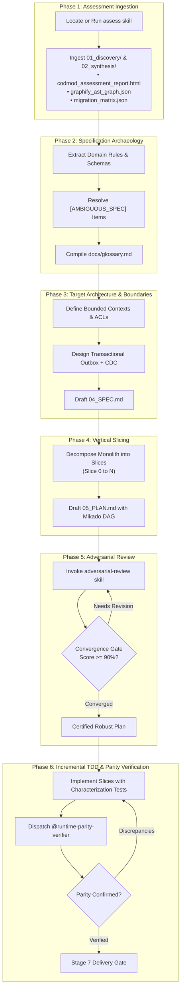

# Skill: Application Rewrite Orchestrator

Orchestrate the end-to-end modernization of legacy codebases into cloud-native architectures. Ensure zero behavioral regressions, decouple monolithic hubs via Anti-Corruption Layers, and verify runtime parity.

---

## Operational Protocol

### Phase 1: Ingest Assessment Deliverables
1. **Verify Assessment Artifacts**:
   - Check if an assessment run exists under `assessments/runs/latest/` or `assessments/index.html`.
   - If no assessment run is found, instruct the user to run the `assess` skill first, or invoke it to generate discovery artifacts.
2. **Extract Key Constraints**:
   - Identify legacy source stack, language version, and build system.
   - Inspect Central Dependency Hubs from `01_discovery/graphify_architecture_report.md` to identify coupling bottlenecks.
   - Extract the 7 Rs classification from `02_synthesis/migration_matrix.json` (Retire vs Replatform vs Refactor).
   - Target modern cloud compute (Cloud Run, GKE) and managed database engines (Cloud SQL, Spanner).

---

### Phase 2: Specification Archaeology & Ubiquitous Language
1. **Extract Domain Rules & Invariants**:
   - Inspect legacy controllers, entity models, and business services using `view_file` and `grep_search`.
   - Reconstruct database schemas, primary keys, foreign key constraints, and indexing strategies.
2. **Compile Domain Glossary**:
   - Write domain definitions, business rules, and API contracts into `docs/glossary.md`.
   - If implicit, contradictory, or undocumented behaviors are found, record them as `[AMBIGUOUS_SPEC: <description>]` and clarify with the user before proceeding to implementation.

---

### Phase 3: Target Domain Architecture & Structural Decoupling
1. **Define Bounded Contexts & Anti-Corruption Layers (ACLs)**:
   - Separate disparate domain models into isolated packages or services.
   - Place Anti-Corruption Layers or Facades in front of legacy Central Dependency Hubs to prevent monolithic coupling leaks.
2. **Data Consistency Strategy**:
   - Do not use distributed 2PC transactions or application-level dual writes.
   - Employ the **Transactional Outbox Pattern** combined with Change Data Capture (CDC) or event messaging.
3. **Compile Technical Specification**:
   - Document target APIs, entity definitions, IAM roles, and cloud resource requirements in `04_SPEC.md`.

---

### Phase 4: Vertical Slicing & Execution Planning
1. **Mikado Slicing Strategy**:
   - Break down the rewrite into vertical, independently verifiable slices:
     - **Slice 0 (Foundation):** Target project scaffolding, CI/CD, database schemas, and baseline health checks.
     - **Slice 1 (Read-Only Path):** Legacy read API replication and contract characterization tests.
     - **Slice 2 (State Mutation & Outbox):** Write paths, transactional outbox events, and validation logic.
     - **Slice 3 (Integration & Cutover):** Edge routing, Strangler Fig proxying, and reverse-sync.
2. **Compile `05_PLAN.md`**:
   - Detail tasks, acceptance criteria, file targets, and rollback procedures.
   - *Tip:* Run the `/synthesize` skill or invoke `@synthesis-agent` to automatically generate or iterate on these slices from existing discovery findings.

---

### Phase 5: Adversarial Review Loop
1. **Invoke Review Skill**:
   - Call the `adversarial-review` skill to audit `05_PLAN.md` against Executive, Engineering, Architectural, and Product criteria.
2. **Iterate to Convergence**:
   - Review and incorporate directives from `@review-arbiter` until the consensus score reaches $\ge 90\%$ with 0 Critical and 0 High defects.
   - Present the hardened plan to the user for formal approval before modifying code.

---

### Phase 6: Incremental Implementation & Runtime Parity Verification
1. **Implement Slices Incrementally**:
   - Write characterization test fixtures capturing legacy inputs and outputs.
   - Generate target code using `write_to_file` and `replace_file_content`.
   - Execute local build and test commands using `run_command` in sandboxed terminals.
2. **Dynamic Parity Verification**:
   - For each completed vertical slice, invoke `@runtime-parity-verifier` using `invoke_subagent`.
   - Replay test vectors against both the legacy endpoint and the modernized candidate.
   - Require `APPROVED: RUNTIME_PARITY_VERIFIED` in `docs/parity_discrepancies.md` before concluding the slice.

---

### Phase 7: Delivery & Final Hand-Off
1. **Emit Modernization Manifest**:
   - Update `assessments/runs/latest/run_manifest.json` with final implementation status, test metrics, and parity diffs.
2. **Present Walkthrough**:
   - Provide the user with a summary of delivered slices, verified parity results, and links to the updated dashboard and code changes.
