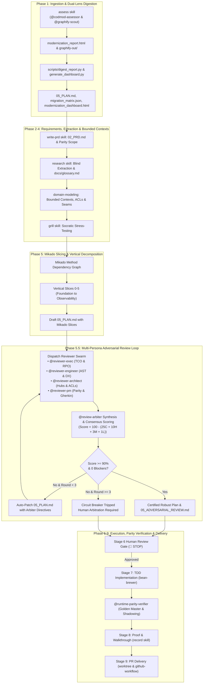

# ☕ Skill: Application Rewrite Brew Protocol

You are executing the **Application Rewrite Brew Protocol**. Rewriting a legacy application requires a structured, risk-mitigated, and language-agnostic approach that guarantees functional parity, resolves architectural technical debt, and maintains compliance with the perfect brew state machine (Stages 0 to 9).

This skill provides a generic orchestrator that walks through analyzing legacy assessment reports (regardless of language or framework), extracting domain details, establishing parity requirements, slicing the monolith, and coordinating implementation using existing specialized repository skills.

---

## 🛠️ Unified Workspace Skills Mapping
An application rewrite leverages the repository's suite of specialized autonomous barista swarm skills:
1. **Assessment & Scanning (Phase 1):** Use the `assess` skill to orchestrate parallel subagents (`@codmod-assessor` and `@graphify-scout`) for concurrent semantic scanning and AST dependency mapping without context bloat.
2. **Requirements & Discovery (Phase 2):** Use the `feature` / `write-prd` skill to initialize directories, draft `02_PRD.md`, and compile the master `visual-dashboard.html`.
3. **Parity Extraction (Phase 3):** Use the `research` skill to do blind, factual extraction of legacy models, endpoints, and business rules to build `docs/glossary.md` and `docs/visual-glossary.html`.
4. **Domain Architecture (Phase 4):** Use the `domain-modeling` skill to define target bounded contexts and architectural decisions.
5. **Socratic Alignment (Phase 4):** Use the `grill` / `grilling` skill to stress-test your rewrite specification and implementation plan.
6. **Execution & Kanban Planning (Phase 5):** Use the `kanban` skill to cut vertical slices, conduct dependency mapping, and generate interactive Kanban tracking boards.
7. **TDD Code Generation (Phase 7):** Use `generate-code` to write backend/frontend codebase slices and `audit-code` for QA compliance.
8. **Testing & Dev Hosting (Phase 7):** Use `dev` to run local backend/frontend servers, and `test-api` to execute local verification suites.
9. **Walkthrough & Recording (Phase 8):** Use the `record` skill to capture high-fidelity terminal playbacks and walkthroughs.
10. **Delivery & Branching (Phase 9):** Use the `worktree` skill and `github-workflow` to manage isolated branches and open clean pull requests.

---

## 🧭 Application Rewrite Lifecycle Flowchart



---

## 🧭 Generic & Flexible Step-by-Step Protocol

### Step 1: Ingest Assessment Report & Architectural Dependencies (Dual-Lens Engine)
1. **Locate or Generate Assessment & Dependency Map:**
   - Look for pre-generated assessment artifacts (e.g., `modernization_report.html` and `graphify-out/graph.json`). If none exist, invoke the `assess` skill, which dispatches parallel subagents (`@codmod-assessor` and `@graphify-scout`) to generate both concurrently without context pollution.
   - Run the automated digest tool to cross-reference recommendations with codebase architecture and build the unified dashboard:
     ```bash
     python3 scripts/digest_report.py \
       --report <path-to-report.html> \
       --graph <path-to-graphify-out/graph.json> \
       --output-dir plans/<slug>/<timestamp>
     ```
     This automatically emits `modernization_dashboard.html`, `migration_matrix.json`, and `05_PLAN.md`, while mirroring `00_visual-dashboard.html` to conversation system artifacts for instant inspection.
2. **Determine Source Stack & Target Runtime:**
   - Identify the source language and frameworks (e.g., legacy Java/Spring, .NET Framework / C#, C/C++, COBOL, mainframe, or modern monolith).
   - Identify the target modernized platform (e.g., Java 21/Spring Boot 3.x, .NET Core/8/9, Go, Node.js/TypeScript).
   - Identify the target compute environment (e.g., Cloud Run, Google Kubernetes Engine (GKE), App Engine) and data tier (e.g., Google Cloud SQL, Cloud Spanner, Cloud Memorystore).
3. **Extract Architectural Structure & Component Modules:**
   - Note codebase scale (Lines of Code (LOC) and file counts).
   - Inspect the codebase breakdown for discovered **Component Modules** (functional subsystems like Repositories, Entities, Controllers) and **Central Dependency Hubs** (load-bearing classes that have the most incoming callers and outgoing dependencies, meaning high blast radius).
   - Map external dependencies, runtime frameworks, and build engines (e.g., Maven, Gradle, MSBuild, dotnet CLI, npm).
4. **Identify Architectural Technical Debt & Strategic Drivers:**
   - **Coupling & Cohesion:** Are business rules, data access, and UI tightly coupled? Are there cross-subsystem dependency leaks?
   - **Central Dependency Hubs:** Which core classes act as bottlenecks that require Anti-Corruption Layers (ACLs) or Facade isolation to prevent changes from rippling across the system?
   - **State & Scalability:** Is the application limited by single-node in-memory state or local sessions that prevent horizontal scalability?
   - **Security Posture:** Are there hardcoded secrets, plain-text connection strings, or unrestricted actuator/metrics endpoints?
   - **Concurrency & Performance:** Are blocking I/O calls limiting throughput? (e.g., synchronous database queries or single-threaded loops).

### Step 2: Initialize Plan & Parity Requirements (Stage 2 - PRD)
1. **Initialize Versioned Directory:**
   - Determine a target slug name (e.g., `rewrite-<app-slug>`).
   - Create the versioned path: `plans/<slug>/<YYYY-MM-DD_HHMM>/`.
2. **Draft the PRD (`02_PRD.md` & `visual-dashboard.html`):**
   - Incorporate the report findings and strategic recommendations directly.
   - Mandate strict API, input validation, and layout/view parity for existing screens and routes.
   - Specify **Non-Goals** (e.g., "We are NOT adding new user features in this pass; this is a strict rewrite for technical modernization, security, and performance").
   - Follow the **Dual-Write Requirement** (Rule 5) via `python3 scripts/manage_dashboard.py mirror --plan-dir "plans/<slug>/<timestamp>"` to mirror `visual-dashboard.html` and `02_PRD.md` to system artifacts as `00_visual-dashboard.html` and `02_prd.md` respectively.

### Step 3: Domain Extraction & Ubiquitous Glossary (Stage 3 - Extraction)
1. **Launch Research Subagent:** Run the `research` skill to scan the legacy code and extract factual specifications:
   - **Legacy Models & Schemas:** Map database schemas, table layouts, core entity relationships, and value objects.
   - **Legacy API & Entry Surfaces:** Extract the full catalog of entry points (HTTP routes, SOAP/WSDL endpoints, MVC controllers, file ingestion jobs, or CLI interfaces).
2. **Publish the Ubiquitous Glossary:**
   - Create `docs/glossary.md` and `docs/visual-glossary.html` documenting domain terms, business rules, validations, and API contracts.
   - Mirror these to the system artifacts folder as `01_visual-glossary.html` (Rule 5).

### Step 4: Target Domain Modeling & Socratic Alignment (Stage 4 - Spec)
1. **Architect Target Models & Architectural Quanta:** Use the `domain-modeling` skill to design target entity classes, repositories, and services aligned with modern target runtime idioms (e.g., Java Records, .NET primary constructors, non-blocking handlers). Calculate architectural quanta by balancing disintegration drivers (agility, elasticity, blast radius) against integration drivers (ACID transactions, saga overhead, latency).
2. **Strangler Fig & Structural Decoupling:**
   - **Ingress Interception:** Plan API Gateway, Edge Reverse Proxy, or CDN routing to divert traffic between legacy monolith and target microservices.
   - **UI Composition:** Select Page Composition (routing URL paths to modern micro-frontends at edge CDN) or Widget Composition (Edge-Side Includes / micro-frontend containers).
   - **Branch by Abstraction:** For internal capabilities lacking HTTP boundaries, execute across 5 stages: (1) Abstract provider interface, (2) Re-point call sites to abstraction, (3) Alternate out-of-process implementation, (4) Dynamic feature toggle, (5) Decommission legacy implementation.
3. **Data Modernization & State Integrity Strategy (No Dual-Writes):**
   - Strictly prohibit application-level dual-writes and heavy 2PC protocols.
   - Implement the **Transactional Outbox Pattern** coupled with **Log-Based Change Data Capture (CDC)** (e.g. Debezium tailing WAL/binlog to Kafka).
   - Coordinate cross-boundary transactions using **Sagas** (orchestrated or choreographed) with idempotent handlers and semantic compensating actions.
   - Execute the 4-phase data cutover: (A) Snapshot + log tailing ➔ (B) Monolith writes authoritative ➔ (C) Modern service writes authoritative with reverse-CDC rollback ➔ (D) Sever synchronization.
4. **Draft `04_SPEC.md` & `04_visual-spec.html`:** Document the target system design, data architecture, security hardening (Secret Manager, IAM), and SRE/observability integrations. Mirror to system artifacts.
5. **Conduct Socratic Grill:** Execute the `grill` / `grilling` skill to stress-test your design and ensure all edge cases are answered before writing code.

### Step 5: Decompose Monolith into Logical Vertical Slices (Stage 5 - Execution Plan)
1. **The Mikado Method Dependency Graph:**
   - Define the root architectural modernization goal.
   - Map prerequisite dependencies and leaf nodes into a directed acyclic graph (DAG).
   - Enforce the Mikado refactoring rule during execution: if an attempted code change breaks compilation or characterization tests, immediately execute a hard reset (`git reset --hard`), record the blocking cause as a prerequisite child node, and resolve leaf nodes first.
2. **Draft the Slice-Based Execution Plan (`05_PLAN.md`):**
   - Establish physical contract signatures first.
   - Categorize tasks into `[Serial]` and parallelizable (`[Parallel]`) chunks.
   - Leverage `scripts/digest_report.py` to auto-generate the preliminary `05_PLAN.md` and `migration_matrix.json`.
   - **Dependency-Ordered Slicing Pattern (Leaf to Root):**
     - **Slice 0 (Common Foundation & Infrastructure):** Target build system configuration (JDK 21, .NET 9), runtime properties, compiler plugins, schema migrations, and CI wrappers.
     - **Slice 1 (Standalone Leaf Modules & Lookup Models):** Low-coupling modules with minimal external dependencies (e.g., lookups, dictionary models, enums). Serves to validate pipeline compilation, data access, and routing.
     - **Slice 2 (Core Domain Repositories & Data Layer):** Main domain services and repositories handling state mutations, validation rules, and heavy transactions. Apply `codmod`'s data layer recommendations (e.g., `javax.*` to `jakarta.*`).
     - **Slice 3 (Central Dependency Hubs & Monolith Decoupling):** High-blast-radius core classes with the most incoming callers and outgoing dependencies. Encapsulate with Anti-Corruption Layers (ACLs) or Facade interfaces to isolate changes.
     - **Slice 4 (Ingress Controllers & Edge Adapters):** MVC controllers, REST endpoints, request formatters, and web templates.
     - **Slice 5 (Target Cloud Hardening & Observability):** Cloud Run configuration, Cloud SQL pooling, GCP Secret Manager, health probes, and OpenTelemetry exporters.
3. **Generate Kanban Visuals:** Use the `kanban` skill to generate an interactive board and Mermaid diagram to map slices and track progress. Mirror `05_PLAN.md` to system artifacts.

### Step 5.5: Multi-Persona Adversarial Plan Hardening Loop (Stage 5.5)
Before presenting `05_PLAN.md` to the user at the Step 6 Human Gate, execute the multi-persona adversarial review loop to stress-test the proposal from opposing perspectives:
1. **Dispatch Adversarial Reviewers:**
   - **`@reviewer-exec` (Executive Perspective):** Scrutinizes TCO, cloud run-rate, licensing sunset timelines, and rollback RPO/MTD.
   - **`@reviewer-engineer` (Engineering Perspective):** Scrutinizes AST safety, reflection breakage, build times, testability, and DX.
   - **`@reviewer-architect` (Architecture Perspective):** Scrutinizes Central Dependency Hubs (`graphify`), Anti-Corruption Layers, distributed state, and horizontal scaling.
   - **`@reviewer-pm` (Product Perspective):** Scrutinizes behavioral parity, undocumented legacy quirks, acceptance criteria (Gherkin), and scope drift.
2. **Arbiter Reconciliation & Convergence:**
   - Invoke **`@review-arbiter`** or run `python3 scripts/review_loop.py --plan-dir <plan_dir>` to parse reviewer findings, calculate the consensus score ($100 - (25C + 10H + 3M + 1L)$), reconcile contradictory trade-offs, and emit `adversarial_review_matrix.json` and `05_ADVERSARIAL_REVIEW.md`.
   - **Convergence Gate:** The plan is hardened and ready for human review once Consensus Score $\ge 90.0\%$ and zero Critical/High findings remain.
   - **Circuit Breaker:** If convergence is not met within 3 rounds, the loop halts and flags the unresolved trade-offs for human arbitration.
3. **Synchronize Unified Dashboard:** Re-run `scripts/generate_dashboard.py` to activate the "🛡️ Adversarial Review" tab and dual-write artifacts (`05_ADVERSARIAL_REVIEW.md`, `adversarial_review_matrix.json`) to the brain directory.

### Step 6: Human Gate & Execution (Stages 6 to 9)
1. **Halt for Approval:** Present the PRD, Spec, Hardened Slice Execution Plan, and Adversarial Review Scorecard to the user. Require explicit "approve" verification.
2. **Slice-by-Slice Implementation:** Execute using TDD via `/tdd` (silent on success) utilizing the `generate-code` and `audit-code` skills to build and verify each slice.
3. **Walkthrough Proof:** Capture terminal playbacks or page tests with the `record` command.
4. **Isolated Branch Delivery:** Build production packages, isolate branch slices using the `worktree` command, and create elegant PRs using `gh` via the `github-workflow` skill.
