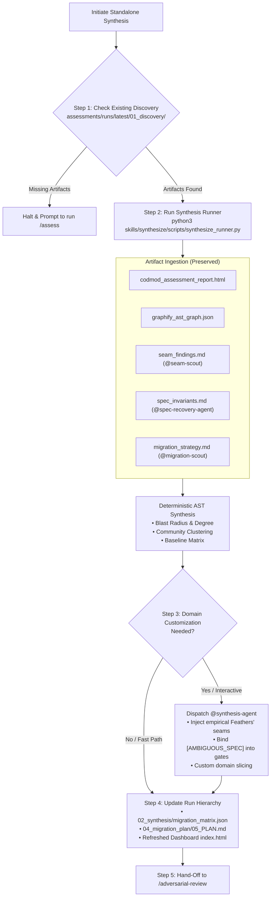

# Skill: Standalone Architectural Synthesis & Slicing

Execute or re-run architectural synthesis on existing assessment discovery artifacts without re-dispatching heavy discovery scouts (`codmod`, `graphify`, etc.). Reconcile multi-scout findings, tailor vertical slices to domain boundaries, and compile actionable `05_PLAN.md` and `migration_matrix.json`.



---

## When to Use This Skill
- **Re-planning**: You already ran `/assess` and want to re-generate or customize `05_PLAN.md` without waiting 10+ minutes for scouts to re-run.
- **Slicing Iteration**: You want to experiment with different slicing strategies (e.g. Bounded Context vs Layered, minimum blast radius vs fast delivery).
- **HITL Invariant Incorporation**: You clarified one or more `[AMBIGUOUS_SPEC]` items with the user or product team and want to fold those answers into the acceptance gates of the plan.
- **Target Architecture Tweaks**: Switching target runtime configurations (e.g. Cloud Run to GKE, or Cloud SQL to Spanner) while retaining identical AST discovery metrics.

---

## Operational Protocol

### Step 1: Target Run Resolution & Discovery Verification
1. Resolve the target assessment run directory:
   - Default: `assessments/runs/latest/` (or most recent run in `assessments/runs/`).
   - Custom: A specific directory or timestamp specified by the user (e.g., `assessments/runs/20260909_120000`).
2. Verify that `01_discovery/` contains the necessary baseline reports:
   - `codmod_assessment_report.html` (or `modernization_report.html`)
   - `graphify_ast_graph.json` (or `graph.json`)
3. If discovery artifacts are missing:
   - Inform the user: *"No previous assessment discovery artifacts found. Please execute `/assess` first to run discovery scouts."*
   - Halt execution cleanly.

---

### Step 2: Execute Standalone Synthesis Runner
Execute the colocated helper script:

```bash
python3 skills/synthesize/scripts/synthesize_runner.py --run-dir latest
```

#### Supported Options:
- `--run-dir <path|id>`: Target a specific historical run.
- `--no-dashboard`: Skip regenerating HTML dashboard UI.
- `--summary-only`: Print scorecard to stdout without overwriting files.

The runner will:
1. Ingest `01_discovery/` reports.
2. Ingest empirical scout reports if present (`seam_findings.md`, `spec_invariants.md`, `migration_strategy.md`).
3. Compute graph degrees, community clusters, and vertical slices.
4. Emit `02_synthesis/migration_matrix.json`, `02_synthesis/vertical_slices.json`, and `04_migration_plan/05_PLAN.md`.
5. Update `run_manifest.json` and refresh the responsive 11-tab dashboard (`index.html`).

---

### Step 3: Domain Customization with `@synthesis-agent` (Optional / On Demand)
If the user specifies custom domain requirements, requests non-standard slicing, or provides domain answers for ambiguous specifications:

1. Dispatch `@synthesis-agent`:
   ```json
   {
     "Subagents": [
       {
         "TypeName": "synthesis-agent",
         "Role": "Synthesis Specialist",
         "Prompt": "Review existing discovery artifacts in assessments/runs/latest/01_discovery/ and baseline plan 04_migration_plan/05_PLAN.md.\n1. Customize vertical slices according to: {{user_constraints_or_domain_rules}}.\n2. Replace synthetic seams with empirical Feathers' seams from 01_discovery/seam_findings.md.\n3. Incorporate ambiguous specification clarifications into acceptance criteria.\n4. Update 04_migration_plan/05_PLAN.md and 02_synthesis/migration_matrix.json directly.",
         "Model": "inherit"
       }
     ]
   }
   ```
2. Await completion notification.
3. Refresh the visual dashboard with `python3 skills/synthesize/scripts/synthesize_runner.py --run-dir latest`.

---

### Step 4: Presentation & Next Action
Present a summary of the synthesized plan to the user:
- Total component modules & central dependency hubs.
- Ordered vertical migration slices.
- Links to:
  - [05_PLAN.md](file:///home/robedwards/workspace/bean-grinder/assessments/runs/latest/04_migration_plan/05_PLAN.md)
  - [migration_matrix.json](file:///home/robedwards/workspace/bean-grinder/assessments/runs/latest/02_synthesis/migration_matrix.json)
  - [Dashboard UI](file:///home/robedwards/workspace/bean-grinder/assessments/runs/latest/index.html)
- Recommend next step:
  > *"Synthesis complete. Review [05_PLAN.md](file:///home/robedwards/workspace/bean-grinder/assessments/runs/latest/04_migration_plan/05_PLAN.md) and run `/adversarial-review` to stress-test the plan."*
